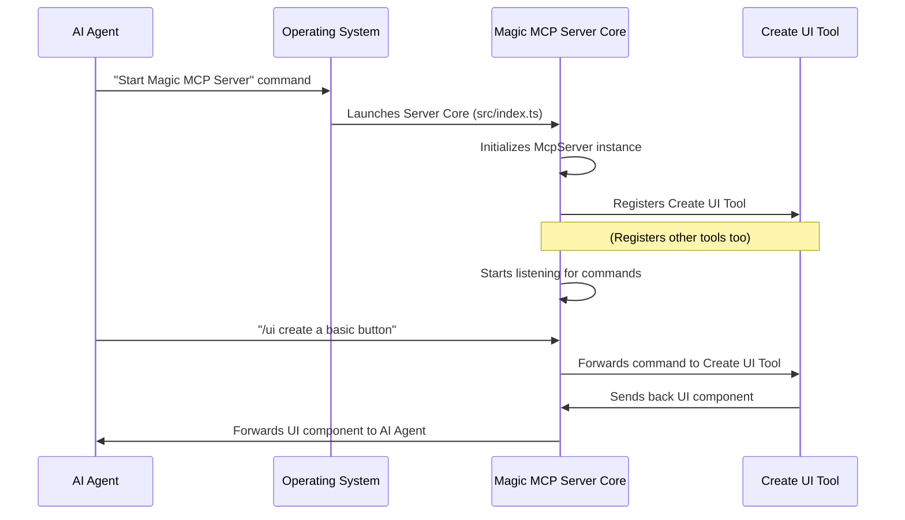

# Chapter 1: Magic MCP Server Core

Imagine you're an ambitious AI agent, and you want to build awesome user interfaces or find the perfect logo for a new project. You have a powerful toolkit called Magic MCP, but how does it all start? How do you get access to all these specialized abilities?

This is where the **Magic MCP Server Core** comes in! Think of it as the main control panel, or the central brain, of a high-tech factory. When you "turn on" the factory, this control panel is the very first thing that starts up. It doesn't do the actual manufacturing (like creating UI components) itself, but it makes sure all the specialized machines (our "tools") are ready and connected, and that the entire operation runs smoothly from start to finish.

## What is the Server Core's Job?

The Magic MCP Server Core has a few crucial responsibilities:

1.  **Starting the Engine**: It's the first part of the Magic MCP application that wakes up. It gets everything ready.
2.  **Connecting the Tools**: It's like a central switchboard where all the specialized tools (like the UI generation tool or the logo search tool) plug in and register themselves. This way, the core knows what functionalities are available.
3.  **Managing the Lifecycle**: It oversees the entire operation, making sure everything runs without a hitch.
4.  **Graceful Shutdowns**: When it's time to close down, the core ensures that all processes stop safely, like turning off all machines in a factory in the correct order to prevent damage.

Essentially, the Magic MCP Server Core is the foundation upon which all other Magic MCP features are built.

## How the Core Kicks Things Off

Let's look at a simplified version of the code that starts our Magic MCP server. You can find this code in the `src/index.ts` file within the project.

When you install and run Magic MCP (as outlined in the [Magic MCP Server Installation Guide](llms-install.md)), this file is executed. Here's what happens, step-by-step:

### 1. Creating the Central Brain

First, the server core creates its main instance. This is like setting up the control panel itself.

```typescript
import { McpServer } from "@modelcontextprotocol/sdk/server/mcp.js";

const server = new McpServer({
  name: "21st-magic", // A friendly name for our server
  version: "0.0.46",  // The current version
});
```

*   `McpServer`: This is the special "brain" object that will manage everything.
*   `name` and `version`: These are just identifiers for our server, telling us what it is and which version we're running.

This `server` object is now our Magic MCP Server Core, ready to take on its responsibilities!

### 2. Registering the Specialized Tools

Once the core is alive, it needs to know what it can actually *do*. It achieves this by registering all the specialized "tools" that handle specific tasks.

```typescript
// These are our specialized "machines"
import { CreateUiTool } from "./tools/create-ui.js";
import { LogoSearchTool } from "./tools/logo-search.js";
// ... other tool imports ...

// We tell the central brain about each machine
new CreateUiTool().register(server);
new LogoSearchTool().register(server);
// ... register more tools here ...
```

*   `CreateUiTool`, `LogoSearchTool`: These are examples of the specialized tools. You'll learn more about how these tools work in [MCP Tool Framework](02_mcp_tool_framework_.md).
*   `.register(server)`: This important step is how each tool connects itself to our `McpServer` core. It's like plugging a new machine into the factory's main power grid and control system.

### 3. Starting Communication and Listening for Commands

After registering all the tools, the core is ready to communicate with the outside world, like your AI agent! It sets up a communication channel and then starts listening for commands.

```typescript
import { StdioServerTransport } from "@modelcontextprotocol/sdk/server/stdio.js";

async function runServer() {
  const transport = new StdioServerTransport(); // Our communication channel
  console.log("Magic MCP Server is starting...");

  // This connects our server core to the communication channel
  await server.connect(transport);
  console.log("Magic MCP Server is now ready!");
}

runServer(); // Let's make it happen!
```

*   `StdioServerTransport`: This is how the server talks to your AI agent, typically using standard input/output.
*   `server.connect(transport)`: This tells the `McpServer` core to start listening for messages coming through the `transport` channel.

Now, the Magic MCP Server Core is fully operational, all tools are connected, and it's waiting for your AI agent to send commands!

## The Lifecycle: From Start to Safe Stop

The core isn't just about starting up; it also manages the entire life of the server, including how it shuts down. Just as it's important to start cleanly, it's vital to stop gracefully to avoid any issues or lost work.

### How a Command Flows Through the Core

Let's visualize how a request from an AI agent travels through our Magic MCP factory, guided by the server core.



As you can see, the Magic MCP Server Core acts as the central router, directing commands to the correct specialized tool and sending responses back to the AI agent.

### Graceful Shutdown

The core is also responsible for shutting down the server neatly. This means closing connections, stopping processes, and generally cleaning up before exiting. This prevents errors or corrupted data.

Here's a simplified look at how `src/index.ts` handles graceful shutdowns:

```typescript
// ... other code ...

let isShuttingDown = false; // A flag to prevent multiple shutdowns

const cleanup = () => {
  if (isShuttingDown) return;
  isShuttingDown = true; // Set flag to indicate shutdown is in progress

  console.log("Shutting down Magic MCP Server safely...");
  try {
    transport.close(); // Close the communication channel
  } catch (error) {
    console.error("Error during transport closure:", error);
  }
  process.exit(0); // Exit the program cleanly
};

// Listen for common shutdown signals from the operating system
process.on("SIGTERM", cleanup); // Signal sent by systems to terminate
process.on("SIGINT", cleanup);  // Signal sent when you press Ctrl+C
process.on("beforeExit", cleanup); // Node.js hook before process exits
```

*   `cleanup()`: This function contains all the steps needed to shut down the server safely. For Magic MCP, a key step is closing the communication `transport`.
*   `process.on("SIGTERM", cleanup)`: This tells the server, "If the operating system tells you to stop (like when a computer restarts), run the `cleanup` function."
*   `process.on("SIGINT", cleanup)`: This means, "If the user presses Ctrl+C, run the `cleanup` function."

This ensures that no matter how the server is asked to stop, it tries to do so in an organized way, preserving data and leaving the system in a clean state.

## Conclusion

You've now taken your first step into understanding Magic MCP! The **Magic MCP Server Core** is the foundational "brain" of the application. It's responsible for starting up, connecting all the specialized tools, managing the server's operation, and ensuring a graceful shutdown. It's the central hub that makes all the exciting functionalities of Magic MCP possible for your AI agent.

Next, we'll dive deeper into the "specialized machines" themselves. In [Chapter 2: MCP Tool Framework](02_mcp_tool_framework_.md), you'll learn about how these individual tools are built and how they integrate with our powerful server core.

---

<sub><sup>Generated by [AI Codebase Knowledge Builder](https://github.com/The-Pocket/Tutorial-Codebase-Knowledge).</sup></sub> <sub><sup>**References**: [[1]](https://github.com/21st-dev/magic-mcp/blob/ba1f71e62879e6c0026322cf518f4ccf02620414/llms-install.md), [[2]](https://github.com/21st-dev/magic-mcp/blob/ba1f71e62879e6c0026322cf518f4ccf02620414/src/index.ts)</sup></sub>