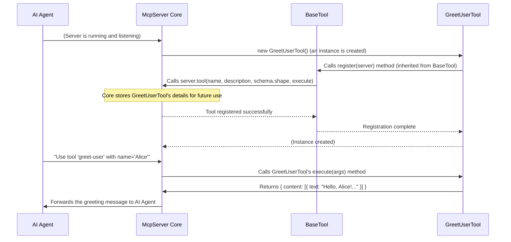

# Chapter 2: MCP Tool Framework

In [Chapter 1: Magic MCP Server Core](01_magic_mcp_server_core_.md), we learned that the Magic MCP Server Core is the central brain that connects and manages various specialized "tools." But how are these individual tools actually created? What rules do they follow so they can all work together smoothly with the server core?

This is where the **MCP Tool Framework** comes in!

## What is the MCP Tool Framework?

Imagine you're building a new car factory. You have a main assembly line (our [Magic MCP Server Core](01_magic_mcp_server_core_.md)), and you want to add specialized machines, like a "wheel installation machine" or a "paint spray machine." For these new machines to fit into the assembly line and work correctly, they need to follow certain standards:

*   They need a clear name ("Wheel Installer").
*   They need a description of what they do ("Attaches wheels to car chassis").
*   They need specific inputs (e.g., "a car chassis," "four wheels," "lug nuts").
*   They need a mechanism to perform their task (the actual robotic arm movements).

The **MCP Tool Framework** is exactly that standardized blueprint or rulebook for creating any new "tool" or capability that the Magic MCP server can offer. It ensures that every tool is built in a consistent way, making it easy for the server core to understand, manage, and use them.

## The Four Pillars of Every MCP Tool

Every tool built within the Magic MCP ecosystem must adhere to this framework. Think of it as a standardized template for making new features, ensuring they all integrate correctly with the main server.

Here are the four key things every tool needs to define:

1.  **Unique Name**: A short, unique identifier for the tool (e.g., `create-ui`, `logo-search`). This is how the server core and AI agents will refer to your tool.
2.  **Clear Description**: A human-readable explanation of what the tool does. This helps AI agents understand when and how to use your tool effectively.
3.  **Input Schema**: This defines *what kind of information* the tool needs to do its job. It's like a structured form that tells the tool (and the AI agent) what arguments or data to provide. For example, a `logo-search` tool might need a `query` (what to search for) and a `color` (preferred color).
4.  **`execute` Method**: This is the core function where the tool actually performs its task. After the tool receives its inputs, this method is called to do the work and return a result.

## Building a Simple Tool: A "Hello World" Example

Let's walk through how you would create a very basic tool that says "Hello!" to a given name. We'll call it `greet-user`.

```typescript
// src/tools/greet-user.ts (Simplified Example)
import { z } from "zod"; // A library to define input shapes
import { BaseTool } from "../utils/base-tool.js"; // Our tool blueprint

// 1. Define the input schema
// This tool needs one input: 'name', which must be a string.
const GreetUserSchema = z.object({
  name: z.string().describe("The name of the user to greet"),
});

export class GreetUserTool extends BaseTool {
  // 2. Give our tool a unique name
  name = "greet-user";

  // 3. Provide a clear description
  description = "Greets a user by their provided name.";

  // 4. Link our input schema
  schema = GreetUserSchema;

  // 5. Implement the 'execute' method
  // This is where the tool does its actual work.
  async execute(args: z.infer<typeof this.schema>) {
    // The 'args' object will contain the 'name' from the input schema.
    const greetingMessage = `Hello, ${args.name}! Welcome to Magic MCP.`;

    // Tools return a structured content object.
    return {
      content: [{ type: "text", text: greetingMessage }],
    };
  }
}
```

In this code:
*   We use `z.object` from the `zod` library to define our `schema`. It tells the server and AI agents that `greet-user` expects an input named `name`, which must be a string.
*   We set the `name` to `"greet-user"` and provide a helpful `description`.
*   The `execute` method takes the input `args` (which contains `name`), constructs a greeting, and returns it in a standardized format.

### Making the Tool Available

Once our `GreetUserTool` is defined, the final step is to tell the [Magic MCP Server Core](01_magic_mcp_server_core_.md) about it. This is done by "registering" the tool in the `src/index.ts` file, just like `CreateUiTool` and `LogoSearchTool` were registered in the previous chapter.

```typescript
// src/index.ts (Snippet)
// ... other imports ...
import { GreetUserTool } from "./tools/greet-user.js"; // Import our new tool

// The central brain of our server
const server = new McpServer({ /* ... */ });

// Register our new GreetUserTool!
new GreetUserTool().register(server);
// ... register other tools here ...
```
After this registration, when the [Magic MCP Server Core](01_magic_mcp_server_core_.md) starts up, it will know about the `greet-user` tool, understand its inputs, and be ready to execute its task when requested by an AI agent.

## Under the Hood: The `BaseTool` Class

The consistency across all tools comes from the `BaseTool` abstract class, located in `src/utils/base-tool.ts`. This class acts as the fundamental blueprint that all specific tools (like `GreetUserTool`, `CreateUiTool`, or [Logo Search Tool](04_logo_search_tool_.md)) extend and implement.

### How Registration Works

When you call `new GreetUserTool().register(server);`, here's a simplified sequence of what happens:



### The `BaseTool` Code Explained

Let's look at the actual code for `BaseTool` to understand its role as the framework's foundation:

```typescript
// src/utils/base-tool.ts (Simplified)
import { McpServer } from "@modelcontextprotocol/sdk/server/mcp.js";
import { z } from "zod"; // Used for defining input schemas

export abstract class BaseTool {
  // These properties MUST be defined by any tool extending BaseTool:
  abstract name: string;        // The tool's unique name
  abstract description: string; // What the tool does
  abstract schema: z.ZodObject<any>; // The expected inputs for the tool

  // This method is provided by BaseTool and handles registration.
  register(server: McpServer) {
    server.tool(
      this.name,              // Passes the tool's name
      this.description,        // Passes the tool's description
      this.schema.shape,       // Passes the defined input schema
      this.execute.bind(this)  // Passes the tool's execution function
    );
  }

  // This method MUST be implemented by any tool extending BaseTool.
  abstract execute(args: z.infer<typeof this.schema>): Promise<{
    content: Array<{ type: "text"; text: string }>;
  }>;
}
```

Breaking it down:

*   **`abstract class BaseTool`**: The `abstract` keyword means this is a template class. You cannot directly create an object from `BaseTool`; you must create a new class (like `GreetUserTool`) that *extends* (builds upon) it.
*   **`abstract name: string;`**: The `abstract` keyword here means that any class extending `BaseTool` *must* define a `name` property.
*   **`abstract description: string;`**: Similarly, any tool *must* provide its own `description`.
*   **`abstract schema: z.ZodObject<any>;`**: Any tool *must* define its `schema` using `zod` to specify its inputs.
*   **`register(server: McpServer)`**: This is the common method that all tools use to connect to the [Magic MCP Server Core](01_magic_mcp_server_core_.md). It calls `server.tool()`, which is a special function on the `McpServer` instance, passing in the tool's `name`, `description`, `schema` (its shape), and the `execute` function. This is how the core learns about your tool and its capabilities.
*   **`abstract execute(...)`**: This is the core logic. The `abstract` keyword means that every tool extending `BaseTool` *must* provide its own implementation of the `execute` method to perform its specific task. It's designed to always return a `Promise` with an object containing `content`, typically an array of text messages.

This framework is what allows Magic MCP to be so flexible. Whether it's the [UI Generation & Refinement Tools](03_ui_generation___refinement_tools_.md) or the [Logo Search Tool](04_logo_search_tool_.md), they all follow this exact blueprint, making them easy to create, integrate, and manage.

## Conclusion

You've now learned about the foundational blueprint for creating any specialized capability within Magic MCP: the **MCP Tool Framework**. This framework ensures all tools are built consistently, requiring a unique name, a clear description, an input schema, and an `execute` method. This standardization is key to how the [Magic MCP Server Core](01_magic_mcp_server_core_.md) can seamlessly discover, understand, and utilize different tools.

Next, we'll dive into specific examples of tools built using this framework. In [Chapter 3: UI Generation & Refinement Tools](03_ui_generation___refinement_tools_.md), you'll explore the tools responsible for generating and refining user interfaces, seeing the framework in action!

---

<sub><sup>Generated by [AI Codebase Knowledge Builder](https://github.com/The-Pocket/Tutorial-Codebase-Knowledge).</sup></sub> <sub><sup>**References**: [[1]](https://github.com/21st-dev/magic-mcp/blob/ba1f71e62879e6c0026322cf518f4ccf02620414/src/index.ts), [[2]](https://github.com/21st-dev/magic-mcp/blob/ba1f71e62879e6c0026322cf518f4ccf02620414/src/utils/base-tool.ts)</sup></sub>