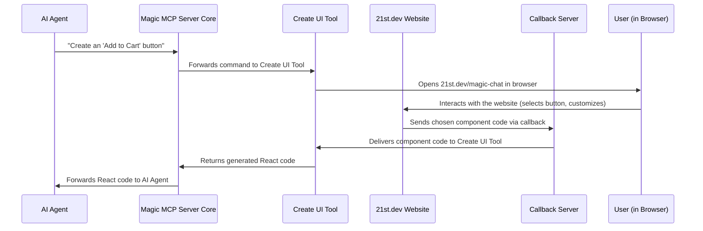

# Chapter 3: UI Generation & Refinement Tools

In [Chapter 2: MCP Tool Framework](02_mcp_tool_framework_.md), we learned about the standard blueprint for creating specialized tools that the Magic MCP server can use. Now, let's see this framework in action by exploring some of the most powerful tools in Magic MCP's arsenal: the ones dedicated to building and improving user interfaces (UIs) for React applications.

## The Challenge of Building UIs

Imagine you're an AI agent tasked with building a new React application. You need buttons, forms, navigation bars, and other visual components. This can be a tricky and time-consuming process:

*   **Design Decisions**: What should the button look like? How should the form be structured?
*   **Coding**: Writing the actual React code, ensuring it's clean and functional.
*   **Refinement**: Making sure the UI looks good and works perfectly, often requiring tweaks and improvements.

Wouldn't it be amazing if you had a team of expert UI/UX designers and developers at your beck and call, ready to instantly create, find inspiration for, or refine any UI component you need, all with just a few simple requests?

This is exactly the problem that Magic MCP's **UI Generation & Refinement Tools** solve! They act as your personal design and development team, helping you build stunning React UIs with unprecedented speed and ease.

## Your UI Specialist Team: Three Powerful Tools

Magic MCP offers three main tools specifically designed to handle different aspects of UI development. Think of them as three specialized members of your UI team, each with a unique superpower:

1.  **The Builder**: For generating brand **new** UI components from scratch.
2.  **The Inspirer**: For finding inspiration and **fetching** existing UI components.
3.  **The Refiner**: For **improving** and redesigning existing UI components.

Let's explore each of these tools and how they make UI development a breeze.

### 1. The Builder: `21st_magic_component_builder` (Create New UI)

This is your go-to tool when you need a completely new UI component. You describe what you want (e.g., "a dark mode toggle button," "a login form with validation"), and this tool guides you through creating it, often interactively.

**Use Case**: You want to add a new "Add to Cart" button to your e-commerce application.

**How an AI Agent Uses It (High-Level)**:
The AI agent would typically call this tool when a user explicitly asks to *create* a new UI element.

*   **AI Agent's Command**: `"/ui create a vibrant 'Add to Cart' button for a product page"`
*   **Tool's Action**: The tool takes this request, gathers more context if needed, and then opens a web browser for an interactive building experience. After you (or the user) confirm the component, it provides the generated React code.
*   **Tool's Output**: A ready-to-use React code snippet for the button, along with instructions on how to integrate it.

Let's see a simplified interaction:



This tool is unique because it often involves a temporary interaction with a web browser (`21st.dev/magic-chat`) to let you visually select or refine the component before the code is generated. We'll explore this "callback" mechanism more deeply in [Chapter 6: Interactive Callback Mechanism](06_interactive_callback_mechanism_.md).

#### Code Deep Dive: `CreateUiTool` (`src/tools/create-ui.ts`)

Let's look at the core of the `CreateUiTool`. Remember from [Chapter 2: MCP Tool Framework](02_mcp_tool_framework_.md) that every tool needs a `name`, `description`, `schema`, and an `execute` method.

```typescript
// src/tools/create-ui.ts (Simplified)
import { z } from "zod";
import { BaseTool } from "../utils/base-tool.js";
import { CallbackServer } from "../utils/callback-server.js"; // For browser interaction
import open from "open"; // To open the browser

export class CreateUiTool extends BaseTool {
  name = "21st_magic_component_builder";
  description = `Use this tool when the user requests a new UI component...`;

  schema = z.object({
    // ... other inputs like user's message, project paths ...
    standaloneRequestQuery: z
      .string()
      .describe("What component user wants to create"),
  });

  async execute({ standaloneRequestQuery }: z.infer<typeof this.schema>) {
    // 1. Start a temporary server to listen for the component code
    const server = new CallbackServer();
    const callbackPromise = server.waitForCallback();
    const port = server.getPort();

    // 2. Open a browser window for interactive component building
    open(`http://21st.dev/magic-chat?q=${encodeURIComponent(standaloneRequestQuery)}&mcp=true&port=${port}`);

    // 3. Wait until the browser sends back the component code
    const { data } = await callbackPromise;
    const prompt = data || "// No component data received. Please try again.";

    // 4. Return the generated code and instructions
    const responseToUser = `\n${prompt}\n\n## Shadcn/ui instructions...`;
    return { content: [{ type: "text", text: responseToUser }] };
  }
}
```

*   `name` and `description`: Clearly tell the AI agent what this tool does.
*   `schema`: Defines what information the tool needs, like the `standaloneRequestQuery` which is your description of the desired component.
*   `execute` method:
    *   It creates a `CallbackServer` which temporarily listens for data. This is crucial for the interactive part.
    *   `open(...)` launches your web browser to `21st.dev/magic-chat`, passing your request and the `port` of the callback server.
    *   `await callbackPromise`: The tool *pauses* here, waiting for `21st.dev` to send the chosen component code back to the `CallbackServer`.
    *   Once the code is received, it's formatted with helpful instructions (like how to install `shadcn/ui` components) and returned.

### 2. The Inspirer: `21st_magic_component_inspiration` (Fetch UI Inspiration)

Sometimes you don't need to *create* a component from scratch, but rather want to see examples, get inspiration, or fetch details about existing components. That's where this tool shines!

**Use Case**: You're building a dashboard and want to see different styles of "data tables."

**How an AI Agent Uses It (High-Level)**:
The AI agent uses this tool when you're looking for existing components, previews, or inspiration.

*   **AI Agent's Command**: `"/21st fetch data tables"`
*   **Tool's Action**: The tool queries `21st.dev` (a library for UI components) for matching components and returns their structured data, often including previews or basic JSON descriptions.
*   **Tool's Output**: JSON data or a text description of available components that match your query, helping you decide which one to use or adapt.

#### Code Deep Dive: `FetchUiTool` (`src/tools/fetch-ui.ts`)

This tool is more straightforward as it doesn't involve interactive browser steps.

```typescript
// src/tools/fetch-ui.ts (Simplified)
import { z } from "zod";
import { BaseTool } from "../utils/base-tool.js";
import { twentyFirstClient } from "../utils/http-client.js"; // For external API calls

export class FetchUiTool extends BaseTool {
  name = "21st_magic_component_inspiration";
  description = `Use this tool when the user wants to see component, get inspiration...`;

  schema = z.object({
    // ... user's full message ...
    searchQuery: z
      .string()
      .describe("Search query for 21st.dev to find a UI component"),
  });

  async execute({ message, searchQuery }: z.infer<typeof this.schema>) {
    // Make an API call to 21st.dev to fetch component data
    const { data } = await twentyFirstClient.post<any>( // <any> simplified
      "/api/fetch-ui",
      { message, searchQuery }
    );

    // Return the fetched data
    return { content: [{ type: "text", text: data.text }] };
  }
}
```

*   `name` and `description`: Define the tool's identity.
*   `schema`: Expects a `searchQuery` to know what kind of UI components to look for.
*   `execute` method:
    *   It uses `twentyFirstClient.post()` to make a request to `21st.dev`'s `/api/fetch-ui` endpoint. This client handles communication with the external `21st.dev` service. (You'll learn more about external API communication in [Chapter 5: External API Communication (21st.dev)](05_external_api_communication__21st_dev__.md)).
    *   The response from `21st.dev` (which contains component data) is then returned to the AI agent.

### 3. The Refiner: `21st_magic_component_refiner` (Refine Existing UI)

Perfecting a UI component often means making tweaks or redesigning parts of it. This tool is designed to take an *existing* component's code and improve it based on your instructions.

**Use Case**: You have an existing `ContactForm` component, but you want to make it more modern and responsive.

**How an AI Agent Uses It (High-Level)**:
The AI agent calls this tool when you ask to `refine`, `improve`, or `redesign` an existing UI component.

*   **AI Agent's Command**: `"/ui improve this ContactForm to be more modern"` (with context of the `ContactForm.tsx` file)
*   **Tool's Action**: The tool reads the content of your specified file, understands your refinement request, sends it to `21st.dev`, and receives a redesigned version.
*   **Tool's Output**: The improved React code for your component, ready to replace the old one, along with any necessary instructions.

#### Code Deep Dive: `RefineUiTool` (`src/tools/refine-ui.ts`)

This tool also communicates with `21st.dev` but focuses on transforming existing code.

```typescript
// src/tools/refine-ui.ts (Simplified)
import { z } from "zod";
import { BaseTool } from "../utils/base-tool.js";
import { twentyFirstClient } from "../utils/http-client.js";
import { getContentOfFile } from "../utils/get-content-of-file.js"; // To read file content

export class RefineUiTool extends BaseTool {
  name = "21st_magic_component_refiner";
  description = `Use this tool when the user requests to re-design/refine/improve...`;

  schema = z.object({
    userMessage: z.string().describe("Full user's message about UI refinement"),
    absolutePathToRefiningFile: z
      .string()
      .describe("Absolute path to the file that needs to be refined"),
    context: z
      .string()
      .describe("Extract the specific UI elements and aspects that need improvement..."),
  });

  async execute({
    userMessage,
    absolutePathToRefiningFile,
    context,
  }: z.infer<typeof this.schema>) {
    // 1. Read the content of the file that needs refining
    const fileContent = await getContentOfFile(absolutePathToRefiningFile);

    // 2. Send the user's message, file content, and context to 21st.dev
    const { data } = await twentyFirstClient.post<any>( // <any> simplified
      "/api/refine-ui",
      { userMessage, fileContent, context }
    );

    // 3. Return the redesigned component code
    return { content: [{ type: "text", text: data.text }] };
  }
}
```

*   `name` and `description`: Define the tool's purpose.
*   `schema`: Requires `userMessage` (what you want changed), `absolutePathToRefiningFile` (where the component code is), and `context` (specific details about the refinement).
*   `execute` method:
    *   It uses `getContentOfFile()` to read the content of the target file. This is crucial because the tool needs the *current* code to refine it.
    *   It then makes an API call to `21st.dev`'s `/api/refine-ui` endpoint, sending the current `fileContent` along with your `userMessage` and `context`.
    *   The redesigned component code received from `21st.dev` is then returned.

## Summary: Your UI Generation & Refinement Team

Here's a quick comparison of our three UI specialist tools:

| Tool Name                       | Purpose                               | Key Differentiator                                    |
| :------------------------------ | :------------------------------------ | :---------------------------------------------------- |
| `21st_magic_component_builder`  | Generate **new** UI components        | Often involves interactive browser experience via `open()` and `CallbackServer`. |
| `21st_magic_component_inspiration` | Get UI **inspiration** and previews | Fetches existing component data (JSON) directly from `21st.dev` via an API.       |
| `21st_magic_component_refiner`  | **Improve** or redesign existing UI | Reads existing file content, sends to `21st.dev` for refinement, returns updated code. |

These tools, built on the solid foundation of the [MCP Tool Framework](02_mcp_tool_framework_.md), empower your AI agent to become a highly efficient UI developer, making the process of building and enhancing React applications faster and more accessible than ever before.

## Conclusion

You've now explored the powerful **UI Generation & Refinement Tools** within Magic MCP. You've seen how `21st_magic_component_builder` helps you create new components, `21st_magic_component_inspiration` provides valuable ideas, and `21st_magic_component_refiner` improves your existing designs. Each tool leverages the `BaseTool` framework to provide specific functionalities, making UI development highly automated and interactive.

Next, we'll shift gears from UI components to visual assets. In [Chapter 4: Logo Search Tool](04_logo_search_tool_.md), you'll discover how Magic MCP can help you find the perfect logo for your projects!

---

<sub><sup>Generated by [AI Codebase Knowledge Builder](https://github.com/The-Pocket/Tutorial-Codebase-Knowledge).</sup></sub> <sub><sup>**References**: [[1]](https://github.com/21st-dev/magic-mcp/blob/ba1f71e62879e6c0026322cf518f4ccf02620414/src/tools/create-ui.ts), [[2]](https://github.com/21st-dev/magic-mcp/blob/ba1f71e62879e6c0026322cf518f4ccf02620414/src/tools/fetch-ui.ts), [[3]](https://github.com/21st-dev/magic-mcp/blob/ba1f71e62879e6c0026322cf518f4ccf02620414/src/tools/refine-ui.ts), [[4]](https://github.com/21st-dev/magic-mcp/blob/ba1f71e62879e6c0026322cf518f4ccf02620414/src/utils/get-content-of-file.ts)</sup></sub>