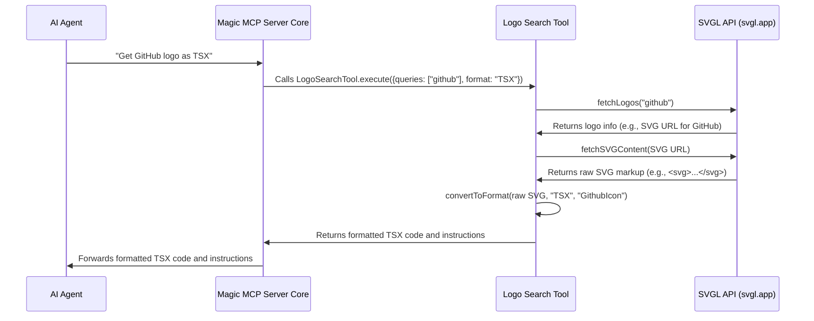

# Chapter 4: Logo Search Tool

In [Chapter 2: MCP Tool Framework](02_mcp_tool_framework_.md), we learned about the standard blueprint for creating specialized tools. Now, let's explore another incredibly useful tool built with this framework: the **Logo Search Tool**.

## The Problem: Finding and Formatting Logos

Imagine you're building a new website or app, and you need to display company logos – maybe for partners, integrations, or social media links. What's usually involved?

1.  **Manual Search**: You open a browser, type "GitHub logo SVG," and hope to find an official, high-quality version.
2.  **Downloading**: You download the SVG file.
3.  **Conversion (Optional but common)**: If your project uses React, you might need to convert that raw SVG into a React component (JSX or TSX) so it can be easily included in your code. This means replacing `class` with `className`, converting inline styles, and wrapping it in a function.
4.  **Repetition**: You repeat this process for every single logo you need.

This can be a tedious and error-prone process. Wouldn't it be great if you could just *ask* for a logo, specify the format you need, and have it delivered directly?

This is exactly what Magic MCP's **Logo Search Tool** does!

## Introducing the Digital Librarian for Logos

Think of the **Logo Search Tool** as your personal, super-efficient digital librarian for company logos. When you (or your AI agent) ask for a logo, it does all the heavy lifting:

*   **Searches**: It taps into a vast collection of SVG logos (from a service like `svgl.app`).
*   **Fetches**: It retrieves the exact SVG code for the logo you requested.
*   **Converts**: It can automatically transform that raw SVG code into a ready-to-use React component (JSX or TSX) or simply provide the raw SVG markup, based on your preference.
*   **Delivers**: It returns the formatted logo code directly, saving you from manual searching, downloading, and conversion.

It's incredibly useful for quickly adding branded icons to any project, making your workflow smoother and faster.

## How to Use the Logo Search Tool

The Logo Search Tool is designed to be simple and direct. You tell it which company's logo you need and what code format you prefer.

### Inputs for the Tool

Like all tools in the [MCP Tool Framework](02_mcp_tool_framework_.md), the Logo Search Tool expects specific inputs defined in its `schema`:

*   `queries`: A list of company names you want logos for (e.g., `["github"]`, `["discord", "slack"]`).
*   `format`: The desired output code format. This can be `"JSX"`, `"TSX"`, or `"SVG"`.

### Example Command (from an AI Agent)

An AI agent might use this tool when you tell it something like:

*   `"/logo GitHub TSX"`
*   `"I need the Discord and Stripe logos in JSX format for my React app."`

The AI agent would then translate your request into a structured tool call:

```json
{
  "tool_name": "logo_search",
  "args": {
    "queries": ["discord", "stripe"],
    "format": "JSX"
  }
}
```

### Example Output

If you request the "GitHub" logo in `"TSX"` format, the tool will return a structured JSON response containing the generated component:

```json
{
  "icons": [
    {
      "icon": "GithubIcon",
      "code": "const GithubIcon: React.FC = () => (<svg viewBox=\"0 0 24 24\" fill=\"currentColor\" width=\"1em\" height=\"1em\" {...props}><path d=\"M12 0C5.373 0 0 5.373 0 12c0 5.302 3.438 9.799 8.205 11.385.6.11.82-.26.82-.58V21.1c-3.122.678-3.793-1.503-3.793-1.503-.51-.13-1.043-.33-1.59-.877-.457-.45-1.127-.728-1.745-.968-.58-.23-.21-.35-.02-.36.57-.01 1.09.26 1.63.77.58.55 1.15.93 1.83.93.68 0 1.25-.18 1.83-.55.07-.46.26-.85.49-1.14.7-.08 1.4-.13 2.1-.13 2.05 0 3.73 1.68 3.73 3.73V21.1c0 .32.22.69.82.58C20.562 21.799 24 17.302 24 12c0-6.627-5.373-12-12-12z\"/></svg>)"
    }
  ],
  "notFound": [],
  "setup": "1. Add these icons to your project:\n   GithubIcon.tsx\n2. Import and use like this:\n```tsx\nimport { GithubIcon } from '@/icons';\n```"
}
```

This response provides the component name (`GithubIcon`), the actual TypeScript React component code, and helpful instructions on how to add and import it into your project!

## Under the Hood: How the Logo Search Tool Works

Let's peek behind the curtain and see how our digital logo librarian processes a request.



Here's what happens step-by-step:

1.  **Request from AI Agent**: Your AI agent sends a request for a logo (e.g., "GitHub logo as TSX").
2.  **Core Forwards**: The [Magic MCP Server Core](01_magic_mcp_server_core_.md) receives the request and, recognizing `logo_search` as the relevant tool, forwards the `queries` and `format` arguments to the `LogoSearchTool`.
3.  **Search for Logo Information**: The `LogoSearchTool` first contacts an external service, `svgl.app` (our vast logo collection), to find basic information about the requested logo, like its title and where to find its actual SVG file.
4.  **Fetch Raw SVG**: Once it has the SVG file's location, the tool makes another request to fetch the raw SVG markup content.
5.  **Convert to Desired Format**: If you asked for JSX or TSX, the tool then takes the raw SVG and transforms it into a proper React component. This involves carefully changing attributes (like `class` to `className`) and structuring the code as a React function component. If you asked for SVG, it simply returns the raw SVG.
6.  **Return Result**: Finally, the tool packages the formatted logo code, along with helpful instructions, into a structured response and sends it back to the [Magic MCP Server Core](01_magic_mcp_server_core_.md), which then delivers it to your AI agent.

## Diving Deeper into the Code (`src/tools/logo-search.ts`)

Let's look at the actual code for the `LogoSearchTool` to see how it implements the [MCP Tool Framework](02_mcp_tool_framework_.md) and performs its magic.

### Tool Definition

Every tool starts by defining its `name`, `description`, and `schema`.

```typescript
// src/tools/logo-search.ts (Snippet)
import { z } from "zod";
import { BaseTool } from "../utils/base-tool.js";

const LOGO_TOOL_NAME = "logo_search";
const LOGO_TOOL_DESCRIPTION = `
Search and return logos in specified format (JSX, TSX, SVG).
Supports single and multiple logo searches with category filtering.
Can return logos in different themes (light/dark) if available.
// ... (rest of description) ...
`;

export class LogoSearchTool extends BaseTool {
  name = LOGO_TOOL_NAME;
  description = LOGO_TOOL_DESCRIPTION;

  schema = z.object({
    queries: z
      .array(z.string())
      .describe("List of company names to search for logos"),
    format: z.enum(["JSX", "TSX", "SVG"]).describe("Output format"),
  });

  // ... rest of the class ...
}
```

*   `name`: `"logo_search"` is the unique identifier for this tool.
*   `description`: This tells AI agents exactly what the tool does and how to use it.
*   `schema`: Uses `zod` to clearly state that the tool needs an array of `queries` (strings) and a `format` (one of "JSX", "TSX", or "SVG").

### Key Methods in `execute`

The `execute` method orchestrates the entire process. It calls several helper methods to perform its task.

#### 1. `fetchLogos(query: string)`

This method makes the initial call to `svgl.app` to find the logo's details.

```typescript
// src/tools/logo-search.ts (Snippet)
// ... inside LogoSearchTool class ...
private async fetchLogos(query: string): Promise<SVGLogo[]> {
  const baseUrl = "https://api.svgl.app";
  const url = `${baseUrl}?search=${encodeURIComponent(query)}`;

  try {
    const response = await fetch(url); // Make the API call
    if (!response.ok) {
      // Handle errors, like logo not found
      return [];
    }
    const data = await response.json(); // Get the logo information
    return Array.isArray(data) ? data : [];
  } catch (error) {
    console.error(`Error fetching logos for ${query}:`, error);
    return []; // Return empty on error
  }
}
```

*   It constructs a URL for the `svgl.app` API.
*   It uses `fetch()` to send a request.
*   If successful, it parses the JSON response which contains details about the logo, including the URL to its SVG content.

#### 2. `fetchSVGContent(url: string)`

Once the tool knows where the SVG content is, this method fetches the raw text of the SVG file.

```typescript
// src/tools/logo-search.ts (Snippet)
// ... inside LogoSearchTool class ...
private async fetchSVGContent(url: string): Promise<string> {
  try {
    const response = await fetch(url); // Fetch the SVG file
    if (!response.ok) {
      throw new Error(`Failed to fetch SVG content: ${response.statusText}`);
    }
    return await response.text(); // Return the raw SVG text
  } catch (error) {
    console.error("Error fetching SVG content:", error);
    throw error;
  }
}
```

*   It takes the `url` of the SVG file.
*   It uses `fetch()` again, but this time expects raw `text` as the response, which is the SVG markup.

#### 3. `convertToFormat(svgContent: string, format: "JSX" | "TSX" | "SVG", componentName: string)`

This is where the magic happens for converting raw SVG into a React component.

```typescript
// src/tools/logo-search.ts (Snippet)
// ... inside LogoSearchTool class ...
private async convertToFormat(
  svgContent: string,
  format: "JSX" | "TSX" | "SVG",
  componentName: string = "Icon"
): Promise<string> {
  if (format === "SVG") {
    return svgContent; // If SVG is requested, return as-is
  }

  // Convert to JSX/TSX: Replace 'class=' with 'className=', etc.
  const jsxContent = svgContent
    .replace(/class=/g, "className=")
    .replace(/style="([^"]*)"/g, (match: string, styles: string) => {
      // Converts inline CSS styles to React-friendly JavaScript objects
      // Example: style="color: red;" -> style={{color: "red"}}
      // (Simplified here for explanation)
      return `style={{ /* ... converted styles ... */ }}`;
    });

  const finalComponentName = componentName.endsWith("Icon")
    ? componentName
    : `${componentName}Icon`;

  return format === "TSX"
    ? `const ${finalComponentName}: React.FC = () => (${jsxContent})`
    : `function ${finalComponentName}() { return (${jsxContent}) }`;
}
```

*   If `format` is `"SVG"`, it simply returns the `svgContent`.
*   Otherwise, it performs string replacements:
    *   `class=` becomes `className=`.
    *   Inline `style="..."` attributes are converted into React's `style={{...}}` object syntax.
*   It wraps the modified SVG content in a React functional component definition, either for TypeScript (`React.FC`) or JavaScript (`function`).

#### The `execute` Method's Flow

Finally, the main `execute` method ties these helpers together:

```typescript
// src/tools/logo-search.ts (Simplified Snippet)
// ... inside LogoSearchTool class ...
async execute({ queries, format }: z.infer<typeof this.schema>) {
  // Process each query
  const results = await Promise.all(
    queries.map(async (query) => {
      // 1. Call fetchLogos to get logo information
      const logos = await this.fetchLogos(query);
      if (logos.length === 0) {
        return { query, success: false, message: `No logo found for: "${query}"` };
      }
      const logo = logos[0];

      // 2. Call fetchSVGContent to get the raw SVG code
      const svgUrl = typeof logo.route === "string" ? logo.route : logo.route.light;
      const svgContent = await this.fetchSVGContent(svgUrl);

      // 3. Call convertToFormat to get the final code
      const formattedContent = await this.convertToFormat(
        svgContent,
        format,
        logo.title + "Icon"
      );

      return { query, success: true, content: `// ${logo.title}\n${formattedContent}` };
    })
  );

  // Combine successful and failed results
  const successful = results.filter((r) => r.success);
  const failed = results.filter((r) => !r.success);

  // (Optional: save test results to a file for debugging/logging)
  // await this.saveTestResult({ queries, format, successful, failed });

  // Format the final response object for the AI agent
  const response = {
    icons: successful.map((r) => ({ /* ... icon details ... */ })),
    notFound: failed.map((f) => ({ /* ... alternatives ... */ })),
    setup: "1. Add these icons to your project:\n   ...\n2. Import and use like this:\n```tsx\nimport { ... } from '@/icons';\n```",
  };

  return { content: [{ type: "text", text: JSON.stringify(response, null, 2) }] };
}
```

*   It uses `Promise.all` to process multiple logo `queries` at the same time.
*   For each `query`, it calls `fetchLogos`, then `fetchSVGContent`, and finally `convertToFormat`.
*   It gathers all the results, separates successful ones from failures, and then formats a final JSON object containing all the logo components and setup instructions.
*   This JSON object is then returned as `content` to the [Magic MCP Server Core](01_magic_mcp_server_core_.md).

## Conclusion

You've now met the powerful **Logo Search Tool**! It acts as your efficient digital librarian, saving you valuable time by automating the tedious process of finding, fetching, and converting company logos into various formats like JSX, TSX, or raw SVG. By leveraging external APIs and internal conversion logic, it exemplifies how Magic MCP tools can extend capabilities far beyond simple text generation.

Next, we'll delve deeper into how Magic MCP tools, like the Logo Search Tool and the UI generation tools, communicate with outside services. In [Chapter 5: External API Communication (21st.dev)](05_external_api_communication__21st_dev__.md), you'll learn about the mechanisms that enable these powerful integrations.

---

<sub><sup>Generated by [AI Codebase Knowledge Builder](https://github.com/The-Pocket/Tutorial-Codebase-Knowledge).</sup></sub> <sub><sup>**References**: [[1]](https://github.com/21st-dev/magic-mcp/blob/ba1f71e62879e6c0026322cf518f4ccf02620414/src/tools/logo-search.ts)</sup></sub>