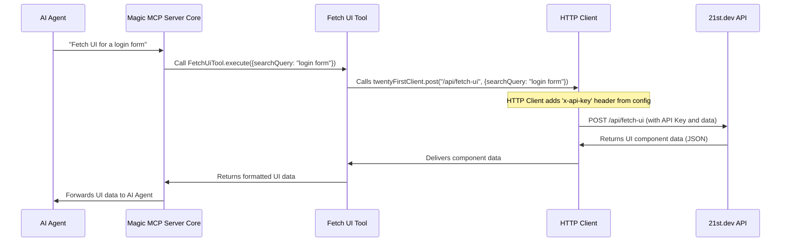

# Chapter 5: External API Communication (21st.dev)

In previous chapters, we've explored the amazing capabilities of Magic MCP. For instance, in [Chapter 3: UI Generation & Refinement Tools](03_ui_generation___refinement_tools_.md), you saw how tools like `21st_magic_component_builder` and `21st_magic_component_refiner` can create or improve UI components. And in [Chapter 4: Logo Search Tool](04_logo_search_tool_.md), you learned how to effortlessly find and format company logos.

But have you ever wondered how these tools perform such powerful actions? They don't just *invent* UI code or conjure logos out of thin air. Instead, they act as intelligent messengers, reaching out to specialized **external services** to get the job done.

## The Problem: Talking to Experts Securely

Imagine you're trying to build a complex project. You need advice from a UI/UX design expert, or perhaps a librarian who knows where to find every company logo. You wouldn't just shout your request into the void; you'd need a secure, reliable way to contact them, tell them what you need, and provide your credentials (like an ID) so they know you're authorized to ask for help.

This is exactly the problem **External API Communication** solves for Magic MCP. When Magic MCP needs to generate a UI, find a logo, or perform other advanced tasks, it often needs to communicate with the `21st.dev Magic API` (or other external services like `svgl.app` for logos). This API is like the expert consultant on the other end of the line.

**External API Communication (21st.dev)** is the abstraction within Magic MCP that handles all these secure conversations. It ensures that requests for UI generation, refinement, or logo searches are sent correctly, including your necessary API key for authentication, and that responses are received. Think of it as a dedicated, secure phone line to an expert consultant, complete with credentials, ensuring smooth and authorized information exchange.

## Key Concepts of External API Communication

To make these "secure phone calls" to external experts, Magic MCP needs a few things:

1.  **An API Key (Your Credentials)**: This is like your personal ID card. It proves to the `21st.dev` service that you are an authorized user of their API. Without it, the "expert" won't talk to you.
2.  **The Base URL (The Expert's Address)**: This is the web address where the `21st.dev` service lives (e.g., `https://magic.21st.dev`). It tells Magic MCP *where* to send its requests.
3.  **The HTTP Client (The Secure Phone)**: This is the actual code mechanism that handles sending and receiving messages over the internet. It takes your request, adds the credentials, sends it to the right address, and waits for a response.
4.  **Request and Response (The Conversation)**: This is the actual exchange of information. Magic MCP sends a "request" (what it needs), and the `21st.dev` API sends back a "response" (the answer or data).

## How Tools Use External API Communication

Let's look at how the `FetchUiTool` (from [Chapter 3: UI Generation & Refinement Tools](03_ui_generation___refinement_tools_.md)) uses this communication mechanism to get UI inspiration.

**Use Case**: You ask the AI agent to "fetch some examples of a login form."

1.  The AI agent identifies that `21st_magic_component_inspiration` (our `FetchUiTool`) is the right tool.
2.  The `FetchUiTool` needs to talk to the `21st.dev` API to get the component data.

Here's a simplified version of the `execute` method from `FetchUiTool`:

```typescript
// Simplified src/tools/fetch-ui.ts
// ... imports ...
import { twentyFirstClient } from "../utils/http-client.js"; // Our secure phone!

export class FetchUiTool extends BaseTool {
  // ... name, description, schema ...

  async execute({ message, searchQuery }: z.infer<typeof this.schema>) {
    // Make an API call to 21st.dev to fetch component data
    const { data } = await twentyFirstClient.post<any>( // Send a POST request
      "/api/fetch-ui", // The specific 'extension' to reach the right expert
      { message, searchQuery } // The actual message/question we are sending
    );

    // Return the fetched data
    return { content: [{ type: "text", text: data.text }] };
  }
}
```

*   `twentyFirstClient.post()`: This is our "secure phone" making a `POST` call (a common way to send data to a server).
*   `"/api/fetch-ui"`: This is the specific "department" or "extension" at the `21st.dev` expert's office that handles fetching UI data.
*   `{ message, searchQuery }`: This is the actual "question" or "request" sent to the expert, in this case, what UI components to search for.
*   `data`: This is the "answer" received from the expert, containing the UI component information.

## Under the Hood: The HTTP Client (`src/utils/http-client.ts`)

Let's peek behind the scenes to see how Magic MCP sets up this "secure phone line." The core logic for external API communication lives in `src/utils/http-client.ts`.

Here's a sequence diagram of how a request flows through this system:



### 1. Your Credentials: The `TWENTY_FIRST_API_KEY`

Before any call is made, Magic MCP needs your API key. This key is your authentication to use the `21st.dev` service.

```typescript
// Simplified src/utils/http-client.ts (API Key snippet)
import { config } from "./config.js";

// Tries to get the API key from:
// 1. Command-line arguments (handled by config.js)
// 2. Environment variable TWENTY_FIRST_API_KEY
// 3. Environment variable API_KEY
const TWENTY_FIRST_API_KEY =
  config.apiKey || process.env.TWENTY_FIRST_API_KEY || process.env.API_KEY;
```

As explained in the [Magic MCP Server Installation Guide](llms-install.md) and handled by `src/utils/config.ts`, you provide this key during setup. This code snippet shows that `http-client.ts` smartly looks for your `TWENTY_FIRST_API_KEY` in various places, prioritizing configuration values.

### 2. The Expert's Address: `BASE_URL`

Next, Magic MCP needs to know *where* to send the requests. This is defined by `BASE_URL`.

```typescript
// Simplified src/utils/http-client.ts (BASE_URL snippet)
// ... imports and API key ...

const isTesting = process.env.DEBUG === "true" ? true : false;
export const BASE_URL = isTesting
  ? "http://localhost:3005"      // If we are debugging, use a local server
  : "https://magic.21st.dev";    // Otherwise, use the official 21st.dev API
```

This ensures that Magic MCP always knows the correct "address" for the `21st.dev` service, whether it's for testing locally or for production use.

### 3. The Secure Phone: `createMethod` and `twentyFirstClient`

The `createMethod` function is like the blueprint for building different types of "phone calls" (GET, POST, PUT, etc.). It makes sure every call includes the necessary headers, especially your API key.

```typescript
// Simplified src/utils/http-client.ts (createMethod snippet)
// ... imports and BASE_URL ...

const createMethod = (method: HttpMethod) => {
  return async <T>(
    endpoint: string,
    data?: unknown, // The message you want to send
    options: RequestInit = {}
  ) => {
    const headers: HeadersInit = {
      "Content-Type": "application/json", // We're sending JSON data
      // Add the API key header if available
      ...(TWENTY_FIRST_API_KEY ? { "x-api-key": TWENTY_FIRST_API_KEY } : {}),
      ...options.headers, // Allow custom headers
    };

    // Make the actual network request
    const response = await fetch(`${BASE_URL}${endpoint}`, {
      ...options,
      method, // e.g., "POST"
      headers,
      ...(data ? { body: JSON.stringify(data) } : {}), // Convert data to JSON string for the body
    });

    // Parse the response from the expert
    return { status: response.status, data: (await response.json()) as T };
  };
};

export const twentyFirstClient: HttpClient = {
  get: createMethod("GET"), // Create a 'GET' phone call function
  post: createMethod("POST"), // Create a 'POST' phone call function
  // ... other methods like put, delete, patch ...
};
```

*   `headers`: This object is crucial. It ensures that `Content-Type: application/json` is always set (telling the expert, "I'm sending you JSON!") and, most importantly, adds your `x-api-key` header with your `TWENTY_FIRST_API_KEY`. This is how your credentials are sent securely.
*   `fetch(`${BASE_URL}${endpoint}`, { ... })`: This is the actual web request. It combines the `BASE_URL` (the expert's address) with the `endpoint` (the specific extension) to form the complete URL.
*   `body: JSON.stringify(data)`: If you're sending data (like a `searchQuery`), it's converted into a JSON string and sent in the body of the request.
*   `twentyFirstClient`: This is the final object that your tools use. It has easy-to-call methods like `post` and `get`, which are pre-configured to handle authentication and JSON communication.

## Conclusion

You've now uncovered the vital role of **External API Communication (21st.dev)** in Magic MCP. This abstraction is the secure "phone line" that connects Magic MCP's powerful tools to external expert services like the `21st.dev Magic API`. By managing API keys, defining base URLs, and using a robust HTTP client, it ensures that your requests for UI components, logos, and more are sent and received securely and reliably. This seamless communication is what allows Magic MCP to extend its capabilities far beyond what it could do on its own.

Next, we'll explore a unique way Magic MCP interacts with you in real-time. In [Chapter 6: Interactive Callback Mechanism](06_interactive_callback_mechanism_.md), you'll learn about how certain tools can open a browser and wait for your input.

---

<sub><sup>Generated by [AI Codebase Knowledge Builder](https://github.com/The-Pocket/Tutorial-Codebase-Knowledge).</sup></sub> <sub><sup>**References**: [[1]](https://github.com/21st-dev/magic-mcp/blob/ba1f71e62879e6c0026322cf518f4ccf02620414/llms-install.md), [[2]](https://github.com/21st-dev/magic-mcp/blob/ba1f71e62879e6c0026322cf518f4ccf02620414/src/utils/config.ts), [[3]](https://github.com/21st-dev/magic-mcp/blob/ba1f71e62879e6c0026322cf518f4ccf02620414/src/utils/http-client.ts)</sup></sub>