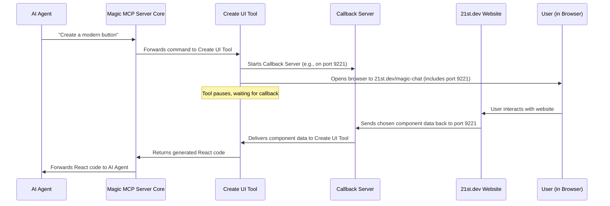

# Chapter 6: Interactive Callback Mechanism

In our last chapter, [Chapter 5: External API Communication (21st.dev)](05_external_api_communication__21st_dev__.md), we learned how Magic MCP tools talk to outside services, like `21st.dev`, to get things done. But what if the conversation needs to be a bit more dynamic? What if *you*, the user, need to be part of that conversation *through a web browser*, and then the website needs to send information *back* to Magic MCP?

This is where the **Interactive Callback Mechanism** comes in!

## The Problem: When a Website Needs to "Call Back" Home

Imagine you're an AI agent, and you've been asked to "create a new login form." Magic MCP has a great tool, `21st_magic_component_builder` (from [Chapter 3: UI Generation & Refinement Tools](03_ui_generation___refinement_tools_.md)), that can help you do this.

But building a UI component isn't always a simple one-and-done command. Sometimes, you need to see options, click around, or pick something visually from a gallery. The `21st.dev` website has a fantastic interactive builder for this.

The challenge is:
1.  Magic MCP needs to open this website for you.
2.  You interact with the website and pick your component.
3.  The website then needs a way to tell Magic MCP *which* component you picked, or send its generated code *back* to Magic MCP so it can continue its work.

It's like sending someone to a store (the `21st.dev` website) to buy something for you. You give them your shopping list (your request), but you also give them a special, temporary "mailbox" where they can drop off the purchase (the selected UI component's code) for you to pick up when they're done.

The **Interactive Callback Mechanism** is that special temporary "mailbox" for Magic MCP! It sets up a temporary local web server to "listen" for data coming back from your browser, completing an interactive workflow.

## Key Concepts of the Callback Mechanism

This mechanism relies on a few core ideas:

1.  **Temporary Local Web Server**: Magic MCP starts a tiny web server on your own computer, just for this one interaction. This server acts as the "mailbox."
2.  **Unique Port Number**: This local server needs an address to be found. It uses a specific "port number" (like an apartment number in a building) on your computer.
3.  **Browser Opening and Interaction**: Magic MCP opens a web page (e.g., `21st.dev/magic-chat`) in your browser. Crucially, it tells this web page the port number of its temporary local server.
4.  **Sending Data Back (The Callback)**: Once you've interacted with the website (e.g., chosen a component), the website uses the provided port number to send the selected data (the component's code) back to your local temporary server. This is the "callback."
5.  **Receiving and Resuming**: Magic MCP's tool (which started the server) waits patiently. When the data arrives at the local server, the tool picks it up and continues its task, providing the component code to your AI agent.

## How the `CreateUiTool` Uses Callbacks

The `CreateUiTool` is the perfect example of this mechanism in action. When you ask to create a new UI component, here’s how it works:



### Example Input and Output (High-Level)

**AI Agent's Command (simplified):**
```
/ui create a login form
```

**What Magic MCP Does:**
1.  The `CreateUiTool` starts a `CallbackServer`.
2.  Your browser automatically opens to a URL like:
    `http://21st.dev/magic-chat?q=login%20form&mcp=true&port=9221`
    (Notice the `port=9221` part – that's how `21st.dev` knows where to send the data back!)
3.  You interact with the `21st.dev` website, choose a login form design, and click "Generate" or "Confirm."
4.  The `21st.dev` website then sends the React code for that login form to your local `CallbackServer` at port `9221`.
5.  The `CreateUiTool` receives this code.

**Tool's Output (returned to AI Agent, simplified):**
```json
{
  "content": [
    {
      "type": "text",
      "text": "```tsx\nimport { Card, CardHeader, CardContent, CardFooter } from \"@/components/ui/card\";\nimport { Input } from \"@/components/ui/input\";\nimport { Button } from \"@/components/ui/button\";\n\nconst LoginForm = () => (\n  <Card>\n    <CardHeader>Login</CardHeader>\n    <CardContent>\n      <Input placeholder=\"Email\" type=\"email\" />\n      <Input placeholder=\"Password\" type=\"password\" />\n    </CardContent>\n    <CardFooter>\n      <Button>Submit</Button>\n    </CardFooter>\n  </Card>\n);\n\nexport default LoginForm;\n```\n\n## Shadcn/ui instructions...\n"
    }
  ]
}
```
You get the full, ready-to-use React component code directly from the interactive website, delivered back to Magic MCP!

## Under the Hood: The `CallbackServer`

Let's look at the simplified code that makes this "temporary mailbox" work. The core logic for this mechanism is found in `src/utils/callback-server.ts` and parts of `src/tools/create-ui.ts`.

### 1. Starting the `CallbackServer` (in `src/tools/create-ui.ts`)

The `CreateUiTool` is responsible for kicking off the callback process.

```typescript
// src/tools/create-ui.ts (Simplified)
// ... imports ...
import { CallbackServer } from "../utils/callback-server.js"; // Our local mailbox
import open from "open"; // To open the browser

export class CreateUiTool extends BaseTool {
  // ... name, description, schema ...

  async execute({ standaloneRequestQuery }: z.infer<typeof this.schema>) {
    // 1. Create a new CallbackServer instance
    const server = new CallbackServer();
    // 2. Tell the server to start listening and wait for data
    const callbackPromise = server.waitForCallback();
    // 3. Get the port number the server is using
    const port = server.getPort();

    // 4. Open the browser, passing the query and the port
    open(`http://21st.dev/magic-chat?q=${encodeURIComponent(standaloneRequestQuery)}&mcp=true&port=${port}`);

    // 5. PAUSE HERE: Wait for data to come back from the browser
    const { data } = await callbackPromise;

    // ... process the received data and return ...
  }
}
```
*   `new CallbackServer()`: Creates an instance of our temporary local server.
*   `server.waitForCallback()`: This is the crucial step. It starts the server and returns a `Promise` that will resolve *only when* data is received from the browser (or if a timeout occurs). The `execute` method then uses `await` to *pause* until this promise resolves.
*   `server.getPort()`: Gets the specific port number that the `CallbackServer` is listening on.
*   `open(...)`: Launches your default web browser to the `21st.dev/magic-chat` URL. It includes the `port` number in the URL so the website knows where to send the callback.

### 2. The `CallbackServer` Itself (in `src/utils/callback-server.ts`)

This class handles setting up the server, listening for requests, and resolving the promise when data arrives.

```typescript
// src/utils/callback-server.ts (Simplified)
import { createServer, IncomingMessage, ServerResponse } from "http";
import net from "net"; // For finding an available port

export class CallbackServer {
  private server: any = null; // Our temporary web server
  private port: number; // The port it listens on
  private promiseResolve?: (value: any) => void; // To resolve the waiting promise

  constructor(startPort = 9221) {
    this.port = startPort; // Start trying from this port
  }

  getPort(): number {
    return this.port; // Returns the actual port being used
  }

  // Helper to find a free port, starting from `this.port`
  private async findAvailablePort(startPort: number): Promise<number> {
    // ... (logic to find an unused port) ...
    return startPort; // Simplified for tutorial
  }

  // This function is called when the server receives a request
  private handleRequest = async (req: IncomingMessage, res: ServerResponse) => {
    res.setHeader("Access-Control-Allow-Origin", "*"); // Allow any website to send data
    res.setHeader("Access-Control-Allow-Methods", "POST, OPTIONS");

    if (req.method === "OPTIONS") {
      res.writeHead(200); res.end(); return;
    }

    if (req.method === "POST" && req.url === "/data") {
      // If it's a POST request to /data, this is our callback!
      let body = "";
      for await (const chunk of req) {
        body += chunk.toString(); // Read the incoming data
      }

      if (this.promiseResolve) {
        this.promiseResolve({ data: body }); // Resolve the waiting promise with the data
        this.shutdown(); // Shut down the server, its job is done!
        res.writeHead(200); res.end("success");
      } else {
        res.writeHead(500); res.end("Server not ready");
      }
      return;
    }
    res.writeHead(404); res.end("Not found");
  };

  private async shutdown(): Promise<void> {
    if (this.server) {
      this.server.close();
      this.server = null;
    }
    // ... clear any timeout ...
  }

  async waitForCallback(config: { timeout?: number } = {}): Promise<any> {
    this.port = await this.findAvailablePort(this.port); // Find a free port

    this.server = createServer(this.handleRequest); // Create the server
    this.server.listen(this.port, "127.0.0.1"); // Start listening on the port

    return new Promise<any>((resolve, reject) => {
      this.promiseResolve = resolve; // Store the resolve function
      // ... setup timeout and error handling ...
      console.log(`Callback server listening on http://127.0.0.1:${this.port}/data`);
    });
  }
}
```
*   `constructor(startPort = 9221)`: The server tries to start on port 9221 by default, but can find another if that one's busy.
*   `findAvailablePort()`: This utility ensures that the server finds a port that isn't already being used, so there are no conflicts.
*   `createServer(this.handleRequest)`: This creates a standard Node.js HTTP server. `handleRequest` is the function that runs every time a message (HTTP request) arrives at our server.
*   `this.server.listen(this.port, "127.0.0.1")`: This command actually starts the server and tells it to begin listening for messages on the chosen `port` on your local machine (`127.0.0.1` means "this computer").
*   `handleRequest`: This is the heart of the callback.
    *   It sets `Access-Control-Allow-Origin: *` which is important for allowing the `21st.dev` website (which is a different "origin" or domain) to send data to your local server.
    *   It specifically looks for `POST` requests sent to the `/data` path. This is the agreed-upon way `21st.dev` will send information back.
    *   When such a request arrives, it reads the `body` (which contains the component code).
    *   `this.promiseResolve({ data: body })`: This is the magic! It calls the `resolve` function of the `Promise` that the `CreateUiTool` is `await`ing. This makes the `CreateUiTool` "wake up" and continue its execution with the `data` it just received.
    *   `this.shutdown()`: Once the data is received and delivered, the temporary server's job is done, and it gracefully shuts itself down to free up the port.

This entire dance between `CreateUiTool`, your browser, `21st.dev`, and the `CallbackServer` is how Magic MCP enables powerful, interactive workflows that go beyond simple text-based interactions.

## Conclusion

You've now uncovered the ingenious **Interactive Callback Mechanism** within Magic MCP! This system allows Magic MCP tools, particularly those requiring visual user interaction, to launch a web browser, let you make choices on a website, and then have that website send chosen data *back* to Magic MCP's local temporary server. This seamless "callback" completes the interactive loop, enabling sophisticated workflows like dynamic UI component generation.

Next, we'll shift our focus to how Magic MCP keeps track of everything that happens behind the scenes. In [Chapter 7: Agent-Friendly Logging](07_agent_friendly_logging_.md), you'll learn about how Magic MCP provides clear, concise, and useful logs for both humans and AI agents.

---

<sub><sup>Generated by [AI Codebase Knowledge Builder](https://github.com/The-Pocket/Tutorial-Codebase-Knowledge).</sup></sub> <sub><sup>**References**: [[1]](https://github.com/21st-dev/magic-mcp/blob/ba1f71e62879e6c0026322cf518f4ccf02620414/src/tools/create-ui.ts), [[2]](https://github.com/21st-dev/magic-mcp/blob/ba1f71e62879e6c0026322cf518f4ccf02620414/src/utils/callback-server.ts)</sup></sub>