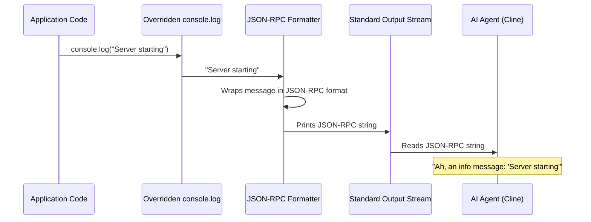

# Chapter 7: Agent-Friendly Logging

In our journey through Magic MCP, we've explored how the [Magic MCP Server Core](01_magic_mcp_server_core_.md) starts, how tools are built with the [MCP Tool Framework](02_mcp_tool_framework_.md), and even how some tools use an [Interactive Callback Mechanism](06_interactive_callback_mechanism_.md) for visual interaction. All these processes generate a lot of internal messages: "Server started!", "Tool executed successfully!", "An error occurred!".

But imagine you're an AI agent, like Cline, trying to understand these messages. If they're just plain text like "Server started," how do you know if that's a good thing or a bad thing? How do you reliably extract information to know if a tool finished its job or crashed? Parsing unstructured text is incredibly difficult and error-prone for AI agents.

This is where **Agent-Friendly Logging** comes in!

## The Problem: AI Agents Can't Read Between the Lines

Regular `console.log` and `console.error` messages are great for human developers. We read them, understand the context, and react. But for an AI agent, plain text messages are like trying to understand a conversation in a crowded, noisy room without a proper interpreter. It's hard to distinguish important status updates from casual chatter, and even harder to automatically react to specific events like errors.

**Agent-Friendly Logging** solves this by providing a specialized interpreter for Magic MCP's internal chatter. This component customizes the standard `console.log` and `console.error` functions so that *all* messages are automatically translated into a structured, machine-readable JSON-RPC format.

## What is Structured JSON-RPC Logging?

Think of it like this: instead of yelling "Server started!" into a void, Magic MCP sends a structured note that says:

"Hey AI, this is an **information** message from the **server**. The message is: 'Server started!'"

This structured note is in a format called **JSON-RPC**. It's a standard way for computer programs to communicate, ensuring that information is always packaged in a predictable and easy-to-parse way.

Here are the key benefits for AI agents:

*   **Easy to Understand**: AI agents can easily parse the structured JSON to know if a message is an informational log or a critical error.
*   **Programmatic Reaction**: They can automatically react to specific events. For example, if a log indicates a tool completed successfully, the AI knows to proceed. If it's an error, the AI knows to investigate or report.
*   **Consistent Format**: No matter what the message content is, the surrounding structure is always the same, making parsing reliable.

## How it Works: Overriding the Console

The magic behind Agent-Friendly Logging is quite clever but simple: Magic MCP secretly replaces your computer's normal `console.log` and `console.error` functions with its own versions.

Here's the high-level flow:

1.  **Application Code Calls `console.log`**: When any part of Magic MCP (like a tool or the server core) calls `console.log("Something happened")`, it's actually calling Magic MCP's *special* `console.log`.
2.  **Message Formatting**: Magic MCP's special `console.log` takes the message, wraps it in the JSON-RPC structure, and adds important details like the message type (info or error).
3.  **Output to Standard Output**: The formatted JSON-RPC string is then printed to the server's standard output, which an AI agent (or a smart terminal) can easily read.

## Let's See It in Action (Simplified)

Instead of a plain text message, every log from Magic MCP looks like this structured data:

**Original Code (anywhere in Magic MCP):**
```typescript
console.log("Magic MCP Server is starting...");
// ... later ...
console.error("Error during transport closure:", errorObject);
```
In `src/index.ts`, you can see similar `console.log` calls:
```typescript
// src/index.ts (Snippet)
// ...
console.log(`Starting server v${VERSION} (PID: ${process.pid})`);
// ...
console.error(`Transport error (PID: ${process.pid}):`, error);
// ...
```

**What the AI Agent Sees (Example Output for `console.log`):**
```json
{"jsonrpc":"2.0","method":"window/logMessage","params":{"type":3,"message":"Magic MCP Server is starting..."}}
```

**What the AI Agent Sees (Example Output for `console.error`):**
```json
{"jsonrpc":"2.0","method":"window/logMessage","params":{"type":1,"message":"Error during transport closure: {\"name\":\"Error\",\"message\":\"Connection lost\"}"}}
```

Notice the `type` field in `params`:
*   `"type": 3` indicates an informational message (like a standard `console.log`).
*   `"type": 1` indicates an error message (like a standard `console.error`).

This small change makes a massive difference for AI agents trying to understand what's happening!

## Under the Hood: The `setupJsonConsole` Function

The core logic for this Agent-Friendly Logging lives in `src/utils/console.ts`. Let's walk through it.

### 1. Activating Structured Logging

First, to enable this feature, the [Magic MCP Server Core](01_magic_mcp_server_core_.md) calls the `setupJsonConsole()` function right at the start of its execution.

```typescript
// src/index.ts (Snippet)
// ... other imports ...
import { setupJsonConsole } from "./utils/console.js";

setupJsonConsole(); // <-- This line activates agent-friendly logging!

const VERSION = "0.0.46";
const server = new McpServer({
  name: "21st-magic",
  version: VERSION,
});
// ... rest of the server setup ...
```
This single line `setupJsonConsole()` is what initializes our "interpreter" for the AI agent.

### 2. The `setupJsonConsole` Implementation (`src/utils/console.ts`)

Now, let's look at how `setupJsonConsole` actually replaces the standard `console` functions.

#### Preserving Original Console Functions

First, it's good practice to save the original `console.log` and `console.error` functions. This way, if needed, we can still use the "real" console output, or ensure that our custom functions eventually call the original ones to actually print to the terminal.

```typescript
// src/utils/console.ts (Snippet)
const originalConsoleLog = console.log;
const originalConsoleError = console.error;

export function setupJsonConsole() {
  // ... custom logic will go here ...
}
```

#### Overriding `console.log`

Next, the `console.log` function is replaced. Whenever `console.log` is called now, our custom version runs instead.

```typescript
// src/utils/console.ts (Snippet)
// ... originalConsoleLog/Error ...
export function setupJsonConsole() {
  console.log = function (...args) {
    // 1. Combine all arguments into a single message string
    const message = args
      .map((arg) => {
        if (typeof arg === "object" || Array.isArray(arg)) {
          try {
            return JSON.stringify(arg); // Convert objects/arrays to JSON strings
          } catch (e) {
            return String(arg); // Fallback if stringify fails
          }
        }
        return String(arg); // Convert other types to string
      })
      .join(" "); // Join multiple arguments with a space

    // 2. Format the message into the JSON-RPC structure
    originalConsoleLog( // We use originalConsoleLog to actually print the JSON string
      JSON.stringify({
        jsonrpc: "2.0",            // Standard JSON-RPC version
        method: "window/logMessage", // The method name for logging messages
        params: {
          type: 3,                 // Type 3 means informational message (log)
          message: message,        // Our combined message
        },
      })
    );
  };
  // ... console.error override ...
}
```

Breaking it down:
*   `console.log = function (...args)`: This line replaces the global `console.log` with our new function. It can accept any number of arguments (`...args`).
*   `args.map(...)`: It goes through each argument passed to `console.log`. If an argument is an object or array, it tries to convert it into a JSON string using `JSON.stringify()`. Otherwise, it converts it to a regular string.
*   `join(" ")`: All the processed arguments are then joined together with spaces to form one complete `message` string.
*   `originalConsoleLog(JSON.stringify({...}))`: This is the crucial step. It takes our structured data object (containing `jsonrpc`, `method`, `params.type`, and `params.message`) and converts it into a single JSON *string*. This string is then passed to the *original* `console.log` to be printed to the console.

#### Overriding `console.error`

The `console.error` override is very similar, but it sets a different `type` in the JSON-RPC message to indicate an error.

```typescript
// src/utils/console.ts (Snippet)
// ... console.log override ...
console.error = function (...args) {
  // 1. Combine all arguments into a single message string (same as console.log)
  const message = args
    .map((arg) => {
      if (typeof arg === "object" || Array.isArray(arg)) {
        try {
          return JSON.stringify(arg);
        } catch (e) {
          return String(arg);
        }
      }
      return String(arg);
    })
    .join(" ");

  // 2. Format the message into the JSON-RPC structure, with type 1 for error
  originalConsoleError( // We use originalConsoleError to print the JSON string
    JSON.stringify({
      jsonrpc: "2.0",
      method: "window/logMessage",
      params: {
        type: 1,                 // Type 1 means error message
        message: message,
      },
    })
  );
};
```
The main difference here is `type: 1` in the `params` object, clearly signaling to any listening AI agent that this is an error.

### How a Log Call Becomes Agent-Friendly

Let's visualize this process with a simple sequence diagram:



This diagram shows how a simple `console.log` call is intercepted, transformed into a structured JSON-RPC message, and then emitted, ready to be understood by an AI agent.

## Conclusion

You've now explored **Agent-Friendly Logging**, a crucial component that transforms Magic MCP's internal messages into a structured, machine-readable JSON-RPC format. By overriding standard `console.log` and `console.error` functions, Magic MCP ensures that AI agents like Cline can easily understand the server's operational status, debug information, and errors programmatically, enabling more intelligent and robust interactions.

This chapter concludes our deep dive into the core components of Magic MCP. You've now seen how the server starts, how tools are built, how they interact with external services and users, and how they communicate their status. This comprehensive understanding empowers you to build even more advanced and integrated AI solutions!

---

<sub><sup>Generated by [AI Codebase Knowledge Builder](https://github.com/The-Pocket/Tutorial-Codebase-Knowledge).</sup></sub> <sub><sup>**References**: [[1]](https://github.com/21st-dev/magic-mcp/blob/ba1f71e62879e6c0026322cf518f4ccf02620414/src/index.ts), [[2]](https://github.com/21st-dev/magic-mcp/blob/ba1f71e62879e6c0026322cf518f4ccf02620414/src/utils/console.ts)</sup></sub>