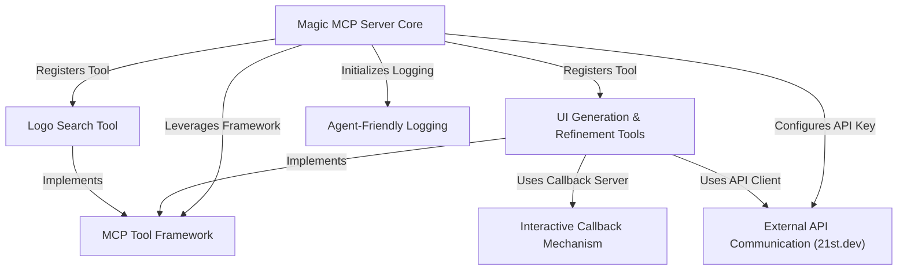

# Tutorial: magic-mcp

The Magic MCP project serves as a central **AI agent-friendly server** that streamlines the development of React applications. It integrates a variety of *specialized tools* that can **generate, fetch inspiration for, and refine UI components**, as well as **search for and convert company logos**. The server *communicates securely* with the 21st.dev Magic API for advanced UI tasks and utilizes an *interactive callback mechanism* for browser-based workflows, all while providing **structured JSON-RPC logging** for seamless AI understanding.

## Visual Overview

## Chapters

1. [Magic MCP Server Core
](01_magic_mcp_server_core_.md)
2. [MCP Tool Framework
](02_mcp_tool_framework_.md)
3. [UI Generation & Refinement Tools
](03_ui_generation___refinement_tools_.md)
4. [Logo Search Tool
](04_logo_search_tool_.md)
5. [External API Communication (21st.dev)
](05_external_api_communication__21st_dev__.md)
6. [Interactive Callback Mechanism
](06_interactive_callback_mechanism_.md)
7. [Agent-Friendly Logging
](07_agent_friendly_logging_.md)

---

Generated by [AI Codebase Knowledge Builder](https://github.com/The-Pocket/Tutorial-Codebase-Knowledge).