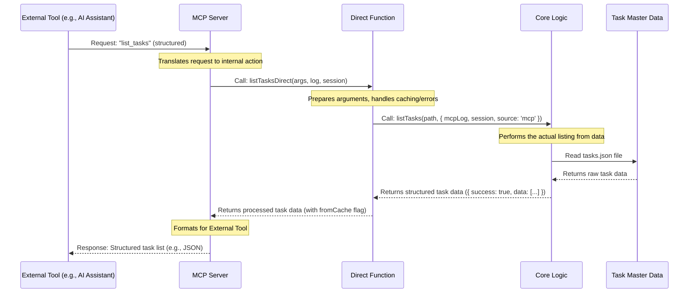

# Chapter 1: MCP Server (Model Context Protocol)

Welcome to the exciting world of `claude-task-master`! In this chapter, we're going to explore the very first piece of our puzzle: the **MCP Server**. Don't worry if these terms sound complex right now; we'll break them down step-by-step.

## What Problem Does the MCP Server Solve?

Imagine you're trying to build a really cool house (your project!), and you have many different skilled workers (like AI assistants, or other helpful tools). Each worker speaks a slightly different language and prefers to receive instructions in their own way.

For example, your AI assistant might want to know: "What tasks do I have pending?" but it expects that question as a simple, structured message. On the other hand, `claude-task-master` (the core of our project) typically understands commands given through a command-line interface, like `task-master list --status pending`.

This is where things get tricky! How do you get your AI assistant to seamlessly talk to `claude-task-master` without having to learn all those complex command-line instructions?

The **MCP Server (Model Context Protocol)** is our solution. It acts like a **universal translator** or a **friendly receptionist** for `claude-task-master`.

## The MCP Server: Your Project's Universal Translator

The MCP Server's main job is to allow external tools (like AI assistants or integrated development environments such as Cursor) to communicate with `claude-task-master` easily and efficiently.

Here's how it works:

1.  **Structured Requests**: Instead of the AI assistant typing a complex command, it sends a simple, structured request to the MCP Server. Think of it like picking an item from a menu, say "list all tasks."
2.  **Translation**: The MCP Server receives this "menu order" and translates it into the specific actions that `claude-task-master` understands, like running the `list` command with certain options.
3.  **Action & Response**: `claude-task-master` performs the action (e.g., fetching your task list) and sends the information back to the MCP Server.
4.  **Translation Back**: The MCP Server then translates this information into a structured, easy-to-understand format for the AI assistant.

This way, the AI doesn't need to know the inner workings of `claude-task-master`. It just sends a clear request and gets a clear response, enabling smarter and more integrated workflows.

## A Simple Use Case: Listing Tasks

Let's walk through a concrete example. Imagine your AI assistant wants to get a list of all your current tasks.

**Without MCP Server (Difficult!):**

The AI would somehow need to:
*   Open a command-line terminal.
*   Type `task-master list`.
*   Read the text output, which might have colors and formatting.
*   Figure out how to parse that text to extract the actual task data.

This is tedious and prone to errors for an AI!

**With MCP Server (Easy!):**

The AI just needs to:
1.  Send a simple, clear message to the MCP Server saying: "Hey, give me the list of tasks." (This is called `list_tasks` in our system).
2.  The MCP Server handles all the translation, talks to `claude-task-master`, and gets the list.
3.  The MCP Server sends back a clean, structured list (like a JSON object) of tasks directly to the AI.

This makes integrating AI with `claude-task-master` much smoother!

## How It Works Under the Hood: The Request Flow

Let's see the journey a request takes from an external tool, through the MCP Server, and back again.



Here's what each step means in simple terms:

*   **External Tool (e.g., AI Assistant)**: This is your AI, or any other program that wants to interact with `claude-task-master`. It sends a request to the MCP Server.
*   **MCP Server**: This is the "receptionist." It receives the request and figures out which specific operation (`claude-task-master` needs to do. It also uses a framework called `FastMCP` to manage these communications.
    *   **File**: `mcp-server/server.js` starts the entire MCP Server.
    *   **File**: `mcp-server/src/index.js` contains the main `TaskMasterMCPServer` class that sets up the server and registers all the "tools" it knows how to handle.
    *   **File**: `mcp-server/src/tools/index.js` is where all the specific tools (like `list_tasks`, `add_task`) are registered.
*   **Direct Function**: Think of this as a specific expert within the MCP Server. When the server gets a request like `list_tasks`, it routes it to the `listTasksDirect` function. These functions are responsible for bridging the MCP request to `claude-task-master`'s actual processing logic. They also handle things like checking if we can use a cached result to be faster!
    *   **File**: `mcp-server/src/core/task-master-core.js` acts like a central directory, importing and re-exporting all these `*Direct` functions.
    *   **File**: `mcp-server/src/core/direct-functions/list-tasks.js` contains the actual `listTasksDirect` function.
*   **Core Logic**: This is where the actual work of `claude-task-master` happens. For `list_tasks`, this would be the function that reads your `tasks.json` file and prepares the list. Notice it gets a special `source: 'mcp'` option so it knows to return structured data rather than printing text to the console.
    *   **File**: `scripts/modules/task-manager.js` (or similar modules) contains these core functions.
*   **Task Master Data**: This is where your tasks are actually stored, typically in a `tasks.json` file.

## Code Spotlight: The Layers of Communication

Let's look at highly simplified examples of how these layers connect for our `list_tasks` use case. Remember, the goal is to show the *connection*, not all the detailed logic.

### 1. The MCP Tool Definition (`mcp-server/src/tools/list-tasks.js`)

This is what the MCP Server tells external tools it can do. It defines the name of the operation (`list_tasks`) and any parameters it expects.

```javascript
// mcp-server/src/tools/list-tasks.js (simplified)
import { z } from "zod"; // Zod helps define expected parameters
import { handleApiResult } from "./utils.js";
import { listTasksDirect } from "../core/task-master-core.js"; // Our Direct Function

export function registerListTasksTool(server) {
  server.addTool({
    name: "list_tasks", // The name the external tool uses
    description: "Lists all tasks.",
    parameters: z.object({ // What inputs this tool can take
      projectRoot: z.string().optional().describe("Root directory of the project"),
      // ... other optional parameters like 'status', 'tag', etc.
    }),
    execute: async (args, { log, session }) => {
      // Calls the Direct Function
      const result = await listTasksDirect(args, log, { session });
      // Formats the response cleanly for the external tool
      return handleApiResult(result, log);
    },
  });
}
```
**Explanation**: This code defines a "tool" called `list_tasks`. When an external tool asks the MCP Server to `list_tasks`, the `execute` part of this tool runs. Its job is mainly to call the `listTasksDirect` function (our expert!) and then format the result nicely using `handleApiResult`.

### 2. The Direct Function (`mcp-server/src/core/direct-functions/list-tasks.js`)

This function is the bridge. It prepares the request for the core logic, handles specific MCP-related tasks (like caching), and ensures a structured return.

```javascript
// mcp-server/src/core/direct-functions/list-tasks.js (simplified)
import { findTasksPath } from '../utils/path-utils.js';
import { listTasks } from '../../../../scripts/modules/task-manager.js'; // Our Core Logic
import { getCachedOrExecute } from '../../tools/utils.js'; // Caching utility

export async function listTasksDirect(args, log, context = {}) {
  const { session } = context;
  const { projectRoot, file, status, tag } = args;

  const tasksPath = findTasksPath({ projectRoot, file }, log);

  // Use caching for read operations to speed things up!
  return getCachedOrExecute(`listTasks:${tasksPath}:${status}:${tag}`, async () => {
    // This is where we call the actual Task Master core logic
    const result = await listTasks(tasksPath, {
      status, tag,
      mcpLog: log, // Special logger for MCP context
      session,
      source: 'mcp' // Tells the core logic to return structured data
    });
    return { success: true, data: result, fromCache: false };
  });
}
```
**Explanation**: The `listTasksDirect` function receives the request from the MCP Tool. It figures out where the `tasks.json` file is (`findTasksPath`). Importantly, it tries to use a cache (`getCachedOrExecute`) to quickly return results if we've asked for the same list recently. Then, it calls the `listTasks` function from the core `task-manager.js` module, making sure to tell it `source: 'mcp'` so we get a clean data object back.

### 3. The Core Logic (`scripts/modules/task-manager.js`)

This is the heart of `claude-task-master`, where the actual work of listing tasks happens. It's designed to be reusable by both the command-line interface and the MCP Server.

```javascript
// scripts/modules/task-manager.js (simplified)
import fs from 'fs'; // To read files

export async function listTasks(tasksPath, options = {}) {
  try {
    const { mcpLog, source } = options;

    if (source !== 'mcp') {
      // If NOT from MCP, show fancy CLI output
      console.log("Listing tasks for CLI user...");
    } else {
      // If from MCP, use the provided logger if available
      mcpLog && mcpLog.info("Listing tasks for MCP request...");
    }

    const fileContent = await fs.promises.readFile(tasksPath, 'utf8');
    const allTasks = JSON.parse(fileContent);

    // Apply filtering based on status or tag (simplified)
    const filteredTasks = allTasks.filter(task => {
        // ... filtering logic ...
        return true; // For this simple example, return all tasks
    });

    // Return structured data for MCP
    return filteredTasks;
  } catch (error) {
    if (source === 'mcp') {
      // For MCP, return an error object
      throw new Error(`Failed to list tasks: ${error.message}`);
    }
    // For CLI, exit process with error
    console.error(`Error: ${error.message}`);
    process.exit(1);
  }
}
```
**Explanation**: The `listTasks` function is the actual worker. It reads the `tasks.json` file. Notice how it checks `if (source !== 'mcp')`. If the call didn't come from the MCP Server, it would normally print messages directly to the command line. But because `listTasksDirect` passed `source: 'mcp'`, it knows to just return the clean list of tasks as data, which is exactly what the AI assistant wants!

## Conclusion

The MCP Server is the crucial first layer in how `claude-task-master` communicates with the outside world, especially with intelligent agents like AI assistants. It acts as a universal translator, taking simple, structured requests and converting them into actions `claude-task-master` understands, then returning clear, structured responses. This layered approach ensures smooth, efficient, and flexible integration.

In the next chapter, we'll dive into **[TaskMasterCore (Facade Layer)](02_taskmastercore__facade_layer__.md)**, which is closely related to the Direct Functions you just saw, and helps simplify how other parts of the system interact with `claude-task-master`'s core abilities.

---

<sub><sup>Generated by [AI Codebase Knowledge Builder](https://github.com/The-Pocket/Tutorial-Codebase-Knowledge).</sup></sub> <sub><sup>**References**: [[1]](https://github.com/eyaltoledano/claude-task-master/blob/b7f32eac5a1eb90ec93cc4597def716335dc4b5f/.cursor/rules/mcp.mdc), [[2]](https://github.com/eyaltoledano/claude-task-master/blob/b7f32eac5a1eb90ec93cc4597def716335dc4b5f/context/MCP_INTEGRATION.md), [[3]](https://github.com/eyaltoledano/claude-task-master/blob/b7f32eac5a1eb90ec93cc4597def716335dc4b5f/mcp-server/server.js), [[4]](https://github.com/eyaltoledano/claude-task-master/blob/b7f32eac5a1eb90ec93cc4597def716335dc4b5f/mcp-server/src/core/task-master-core.js), [[5]](https://github.com/eyaltoledano/claude-task-master/blob/b7f32eac5a1eb90ec93cc4597def716335dc4b5f/mcp-server/src/index.js)</sup></sub>