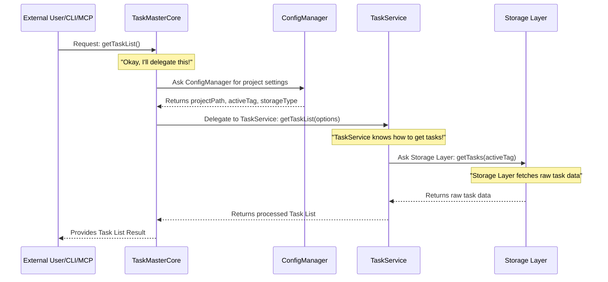

# Chapter 2: TaskMasterCore (Facade Layer)

Welcome back! In [Chapter 1: MCP Server (Model Context Protocol)](01_mcp_server__model_context_protocol__.md), we learned how the MCP Server acts as a friendly translator, letting outside tools (like AI) easily talk to `claude-task-master`. But once a request gets *inside* our system, how does it get handled? That's where `TaskMasterCore` comes in!

## What Problem Does TaskMasterCore Solve?

Imagine you're at a fancy restaurant. You don't go into the kitchen to tell the chef directly how to chop vegetables or cook the sauce. Instead, you order from a simple menu, and the waiter handles all the complex coordination with the kitchen staff.

`TaskMasterCore` is exactly like that simple menu and the smart waiter for `claude-task-master`. It's the **control panel** or the **main dashboard** that offers a clear, simplified way to interact with all the powerful features of our system.

Without `TaskMasterCore`, any part of `claude-task-master` that wants to list tasks, start a task, or change a task's status would need to know *all* the tiny details:
*   How are tasks stored (in a file? in a database? via an API?)
*   How do we load configurations?
*   What's the exact sequence of steps to start a task safely?

This would make our code messy and hard to manage! `TaskMasterCore` solves this by providing a **unified, easy-to-use interface** that hides all those complexities.

## TaskMasterCore: Your Project's Central Control Panel (The Facade)

In software, a "Facade" is a design pattern that provides a simplified interface to a larger, more complex body of code. Think of it as a beautiful, easy-to-use front door to a complicated building.

Here's what `TaskMasterCore` does:

1.  **Simplifies Interactions**: Instead of calling many different internal functions, you just call one function on `TaskMasterCore`, like `listTasks()` or `startTask()`.
2.  **Hides Complexity**: It completely hides how tasks are stored, how configurations are managed, or the exact steps for executing a task. You don't need to know the inner workings!
3.  **Delegates Tasks**: It doesn't do the actual "dirty work" itself. Instead, it smartly passes your request to the right specialized expert (which we call "services") inside the system.

This makes `claude-task-master` much easier to build, maintain, and use for other developers.

## A Simple Use Case: Listing Tasks (The Easy Way!)

Let's revisit our "listing tasks" example from Chapter 1. The MCP Server received a request to list tasks. Now, it needs to tell `claude-task-master` to actually *do* it.

**Using `TaskMasterCore` to list tasks is straightforward:**

First, you need to "turn on" or "create" an instance of `TaskMasterCore` for your project. This needs to know where your project lives.

```typescript
import { createTaskMasterCore } from '@task-master/tm-core'; // The magic function

// Imagine this is your project's main folder
const myProjectPath = '/Users/yourname/my-cool-project';

async function listMyTasks() {
  // 1. Create an instance of TaskMasterCore
  // It handles setting up everything needed behind the scenes.
  const taskMaster = await createTaskMasterCore({
    projectPath: myProjectPath,
  });

  // 2. Now, simply ask TaskMasterCore to list tasks!
  // It returns a result object containing the list of tasks.
  const result = await taskMaster.getTaskList();

  console.log('Here are your tasks:');
  result.tasks.forEach(task => {
    console.log(`- [${task.status}] ${task.title} (ID: ${task.id})`);
  });

  // Remember to close it when you're done, like turning off a light.
  await taskMaster.close();
}

listMyTasks();
```
**Explanation**:
This small piece of code shows how easy it is to work with `TaskMasterCore`.
1.  We `import` `createTaskMasterCore` from the `tm-core` library.
2.  We call `createTaskMasterCore` with `projectPath` to get our `taskMaster` instance. This step initializes everything.
3.  Then, we just call `taskMaster.getTaskList()`. We don't need to worry about *how* it gets the tasks. It just gives us the `result`!
4.  Finally, `taskMaster.close()` cleans up any open connections.

The `result` object will contain a list of `tasks` and other useful information, like the total number of tasks.

## How It Works Under the Hood: Delegation to Experts

When you call `taskMaster.getTaskList()`, `TaskMasterCore` doesn't actually go and read the `tasks.json` file itself. Instead, it delegates this job to a specialized "expert" within the system.

Think of `TaskMasterCore` as the CEO of a company. When a customer (an external tool or even another part of `claude-task-master`) asks for something, the CEO (TaskMasterCore) doesn't do the work. They tell the right department head (a "Service") to handle it.

Here's a simplified view of the delegation:



Let's break down the key players in this sequence:

*   **External User/CLI/MCP**: This is the "customer" making the request.
*   **TaskMasterCore**: The main `TaskMasterCore` instance. It receives the request.
*   **ConfigManager**: This expert knows all about your project's settings, like where your tasks are stored (`projectPath`) or which task "tag" is currently active. (We'll learn more about [Configuration Manager](08_configuration_manager_.md) in a later chapter.)
*   **TaskService**: This is the dedicated expert for *all* things related to tasks – listing them, getting them by ID, updating their status, etc. It contains the core business logic for tasks. (We'll dive into [Task Service (Business Logic Layer)](05_task_service__business_logic_layer__.md) in detail later!)
*   **Storage Layer**: This is where your tasks are actually stored. It could be a file (`tasks.json`), a database, or even a cloud API. `TaskService` asks the Storage Layer to fetch the raw data. (More on [Storage Layer (IStorage)](07_storage_layer__istorage__.md) later!)

## Code Spotlight: The Delegation in Action

Let's look at simplified code from `packages/tm-core/src/task-master-core.ts` to see how `TaskMasterCore` orchestrates this.

### 1. Creating TaskMasterCore (`createTaskMasterCore` function)

This is the recommended way to get your `TaskMasterCore` instance.

```typescript
// packages/tm-core/src/index.ts (simplified)
export { TaskMasterCore, createTaskMasterCore } from './task-master-core.js';

// packages/tm-core/src/task-master-core.ts (simplified)
export async function createTaskMasterCore(
	options: TaskMasterCoreOptions
): Promise<TaskMasterCore> {
	// Calls a static method on the TaskMasterCore class to create and initialize
	return TaskMasterCore.create(options);
}

// Inside TaskMasterCore class (private constructor)
export class TaskMasterCore {
    // ... other properties and methods ...

    // Static method to create and initialize
    static async create(options: TaskMasterCoreOptions): Promise<TaskMasterCore> {
        const instance = new TaskMasterCore(); // Creates the empty object
        await instance.initialize(options); // Calls the private initialize method
        return instance;
    }

    private constructor() {
        // This is private, so you can't just 'new TaskMasterCore()' directly
        // Ensures proper setup through .create()
    }

    // ... more methods ...
}
```
**Explanation**:
The `createTaskMasterCore` function is a helper that makes sure `TaskMasterCore` is always properly set up. It calls a special `static async create` method on the `TaskMasterCore` class. This method creates an empty `TaskMasterCore` object and then calls a private `initialize` method to set everything up. This pattern is important because `TaskMasterCore` needs to load configurations and services *asynchronously* (meaning it takes a little time, like making a phone call, before it's ready to use).

### 2. The Initialization (`initialize` method)

This is where `TaskMasterCore` sets up its "department heads" (the `ConfigManager` and `TaskService`).

```typescript
// packages/tm-core/src/task-master-core.ts (simplified)
import { ConfigManager } from './config/config-manager.js';
import { TaskService } from './services/task-service.js'; // Our Task expert

export class TaskMasterCore {
    private configManager: ConfigManager;
    private taskService: TaskService;
    // ... other services like taskExecutionService ...

    private async initialize(options: TaskMasterCoreOptions): Promise<void> {
        // 1. Set up the Configuration Manager
        this.configManager = await ConfigManager.create(options.projectPath);

        // 2. Set up the Task Service, giving it the ConfigManager
        this.taskService = new TaskService(this.configManager);
        await this.taskService.initialize();
    }
    // ... more methods ...
}
```
**Explanation**:
During `initialize`, `TaskMasterCore` first creates a `ConfigManager` to handle all configuration needs. Then, it creates a `TaskService`, passing it the `configManager`. This is important: `TaskService` needs to know about the project's configuration (like where tasks are stored) to do its job. After setting up, it calls `taskService.initialize()` to ensure the task service itself is ready.

### 3. Delegating `getTaskList()`

Finally, let's see how `TaskMasterCore` actually *delegates* the `getTaskList` request.

```typescript
// packages/tm-core/src/task-master-core.ts (simplified)
import type { TaskListResult, GetTaskListOptions } from './services/task-service.js';

export class TaskMasterCore {
    private taskService: TaskService; // Our Task expert, already initialized

    // ... other methods ...

    /**
     * Get list of tasks with optional filtering
     * This is the public method you call!
     */
    async getTaskList(options?: GetTaskListOptions): Promise<TaskListResult> {
        // Directly calls the TaskService to do the actual work
        return this.taskService.getTaskList(options);
    }
}
```
**Explanation**:
As you can see, the `getTaskList` method in `TaskMasterCore` is very simple! It doesn't contain any complex logic itself. It just calls `this.taskService.getTaskList(options)`, effectively saying: "Hey `TaskService`, you're the expert on tasks, please get the list for me!" This is the core principle of the Facade pattern: providing a simple front-end that delegates complex operations to underlying systems.

## Conclusion

`TaskMasterCore` is the central "control panel" of `claude-task-master`. It acts as a simplified facade, allowing you to easily interact with the system's powerful features like listing or starting tasks, without needing to understand all the complex inner workings. It achieves this by delegating requests to specialized "services" like the `ConfigManager` and `TaskService`. This makes the entire `claude-task-master` project much cleaner, more organized, and easier to use.

Next, we'll dive into a very important feature that helps organize your tasks: [Chapter 3: Tagged Task Lists System](03_tagged_task_lists_system_.md).

---

<sub><sup>Generated by [AI Codebase Knowledge Builder](https://github.com/The-Pocket/Tutorial-Codebase-Knowledge).</sup></sub> <sub><sup>**References**: [[1]](https://github.com/eyaltoledano/claude-task-master/blob/b7f32eac5a1eb90ec93cc4597def716335dc4b5f/packages/tm-core/README.md), [[2]](https://github.com/eyaltoledano/claude-task-master/blob/b7f32eac5a1eb90ec93cc4597def716335dc4b5f/packages/tm-core/docs/listTasks-architecture.md), [[3]](https://github.com/eyaltoledano/claude-task-master/blob/b7f32eac5a1eb90ec93cc4597def716335dc4b5f/packages/tm-core/src/index.ts), [[4]](https://github.com/eyaltoledano/claude-task-master/blob/b7f32eac5a1eb90ec93cc4597def716335dc4b5f/packages/tm-core/src/task-master-core.ts)</sup></sub>