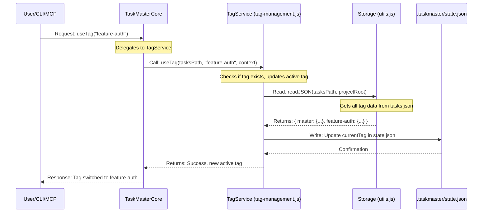

# Chapter 3: Tagged Task Lists System

Welcome back! In [Chapter 2: TaskMasterCore (Facade Layer)](02_taskmastercore__facade_layer__.md), we saw how `TaskMasterCore` acts as a central control panel, simplifying how we interact with all of `claude-task-master`'s powerful features. Now, let's explore a powerful way to *organize* those tasks: the **Tagged Task Lists System**.

## What Problem Do Tagged Task Lists Solve?

Imagine your desk is covered with hundreds of sticky notes, all representing different tasks for your project. Some are for the new "User Authentication" feature, some are for "Bug Fixes," and others are just "Ideas" you want to explore. If all these notes are mixed together, it quickly becomes overwhelming and confusing!

This is similar to what happens if you have just one giant `tasks.json` file for your entire project. If you're working on:
*   A new feature (`feature-x`)
*   Fixing a critical bug (`bug-y`)
*   Experimenting with a new library (`experiment-z`)
*   Collaborating with different teammates on separate parts

...all at the same time, putting all those tasks in one list can lead to chaos. It's hard to tell which tasks belong to which initiative, and changes you make for one feature might accidentally affect another.

The **Tagged Task Lists System** solves this by providing **separate, isolated task lists** within the same project. Think of it like having **multiple, neatly labeled folders** on your desk. Each folder (or "tag") holds tasks related to a specific feature, bug, or experiment.

## Your Project's Organized Folders: Tags

A "tag" in `claude-task-master` is simply a label that groups related tasks together. It creates a dedicated space for those tasks, keeping them completely separate from other tasks.

Here are the key ideas behind tags:

*   **Isolation**: Tasks within one tag are completely independent of tasks in another tag. If you change a task in `feature-auth`, it won't affect any tasks in `bug-fixes`.
*   **Context**: Each tag provides a specific context for your work. You can focus on only the "authentication" tasks when the `feature-auth` tag is active.
*   **The `master` Tag**: Every `claude-task-master` project starts with a default tag called `master`. This is your main, primary task list. If you don't specify a tag, commands will usually operate on `master`.
*   **`state.json`**: `claude-task-master` remembers which tag you're currently working on (your "active" tag) by saving it in a special file called `.taskmaster/state.json`.

## Use Case: Managing Tasks for a New Feature

Let's say you're building a "User Authentication" feature. You want to keep all tasks related to this feature separate from your main `master` task list. Here's how you'd use the Tagged Task Lists System.

### 1. See Your Current Tags (`task-master tags`)

First, you might want to see what tags already exist in your project.

**Command:**
```bash
task-master tags
```

**Example Output:**
```
╭─────────────────────────────────╮
│         Available Tags          │
│                                 │
│ Current Tag: master             │
╰─────────────────────────────────╯
╭───────────────────────────────╮
│ Tag Name      Tasks  Completed│
├───────────────────────────────┤
│ ● master        15       3    │
╰───────────────────────────────╯
```
**Explanation**: This shows you currently have one tag, `master`, which is your active tag, and it contains 15 tasks, with 3 completed.

### 2. Create a New Tag for Your Feature (`task-master add-tag`)

Now, let's create a new tag specifically for your user authentication tasks. You can even copy existing tasks into it if you're starting from a part of your `master` list.

**Command:**
```bash
task-master add-tag feature-auth --description "Tasks for user authentication" --copy-from-current
```

**Example Output:**
```
╭───────────────────────────────────────────────╮
│ ✓ Tag Created Successfully                    │
│                                               │
│ Tag Name: feature-auth                        │
│ Tasks Copied: 15                              │
│ Source Tag: master                            │
│ Description: Tag created from git branch "main"│
╰───────────────────────────────────────────────╯
```
**Explanation**: We created a new tag named `feature-auth`. The `--copy-from-current` option tells `claude-task-master` to take all tasks from your currently active tag (`master`) and duplicate them into the new `feature-auth` tag. This is useful if your new feature *starts* with tasks already planned in `master`.

### 3. Switch to Your New Feature Tag (`task-master use-tag`)

To start working on the `feature-auth` tasks, you need to make it your active tag.

**Command:**
```bash
task-master use-tag feature-auth
```

**Example Output:**
```
╭───────────────────────────────────────────╮
│ ✓ Tag Switched Successfully               │
│                                           │
│ Previous Tag: master                      │
│ Current Tag: feature-auth                 │
│ Available Tasks: 15                       │
│ Next Task: #1 - Implement OAuth flow      │
╰───────────────────────────────────────────╯
```
**Explanation**: You've now switched your focus! All subsequent `claude-task-master` commands will automatically operate on the `feature-auth` task list.

### 4. Work Within the Active Tag (e.g., `task-master list`, `task-master add-task`)

Now, any task operations you perform will only affect the tasks within the `feature-auth` tag. Your `master` tag remains untouched.

**Command (List tasks in `feature-auth`):**
```bash
task-master list
```
**Output (will show tasks from `feature-auth`):**
```
# Tasks for tag: feature-auth
[P] 1: Implement OAuth flow
[P] 2: Create login form
...
```

**Command (Add a task to `feature-auth`):**
```bash
task-master add-task -p "Create forgot password functionality"
```
**Output (new task added to `feature-auth`, not `master`):**
```
Task 'Create forgot password functionality' added to tag 'feature-auth' as ID 16.
```

**Using `--tag` to Override**:
Sometimes you might want to quickly check tasks in *another* tag without switching your active tag. You can do this with the `--tag` flag.

**Command (List tasks in `master` while `feature-auth` is active):**
```bash
task-master list --tag master
```
**Output (will show tasks from `master`, but `feature-auth` is still your active tag):**
```
# Tasks for tag: master
[P] 1: Initialize project setup
[P] 2: Design database schema
...
```
**Explanation**: This is super handy for cross-referencing!

### 5. Delete a Tag (`task-master delete-tag`)

Once a feature is merged or an experiment is abandoned, you might want to clean up.

**Command (Always be careful with this!):**
```bash
task-master delete-tag experiment-zustand --yes
```
**Example Output:**
```
╭──────────────────────────────────────────╮
│ ✓ Tag Deleted Successfully               │
│                                          │
│ Tag Name: experiment-zustand             │
│ Tasks Deleted: 5                         │
╰──────────────────────────────────────────╯
```
**Explanation**: The `--yes` flag skips the confirmation prompt. Without it, `claude-task-master` will ask you twice to confirm, especially if the tag contains tasks. Deleting a tag removes all its tasks permanently. If you delete the currently active tag, `claude-task-master` will automatically switch you back to the `master` tag.

## How It Works Under the Hood: The TagService and State

When you interact with tags, `TaskMasterCore` (from [Chapter 2: TaskMasterCore (Facade Layer)](02_taskmastercore__facade_layer__.md)) delegates the work to a special component, which we can call the **TagService**. This service manages which tag is active and how tasks are stored.

Here's a simplified view of what happens when you switch to a new tag:



### Code Spotlight: Managing Tags

Let's peek at the simplified code that makes this happen.

#### 1. `useTag` function in `tag-management.js`

This function is responsible for changing the active tag.

```javascript
// scripts/modules/task-manager/tag-management.js (simplified)
import { log, readJSON, writeJSON, getCurrentTag } from '../utils.js'; // Our storage helpers
import findNextTask from './find-next-task.js';

async function useTag(tasksPath, tagName, options = {}, context = {}, outputFormat = 'text') {
    const { mcpLog, projectRoot } = context;
    // ... setup logging ...

    // 1. Validate tag name
    if (!tagName || typeof tagName !== 'string') {
        throw new Error('Tag name is required...');
    }
    log.info(`Switching to tag: ${tagName}`);

    // 2. Read tasks.json to verify tag exists
    const data = readJSON(tasksPath, projectRoot); // Reads the whole file with all tags
    const rawData = data._rawTaggedData || data; // Gets the raw structure

    if (!rawData[tagName]) { // Check if the requested tag actually exists
        throw new Error(`Tag "${tagName}" does not exist`);
    }

    // 3. Get previous active tag
    const previousTag = getCurrentTag(projectRoot);

    // 4. Update the active tag in state.json
    await switchCurrentTag(projectRoot, tagName); // This writes to .taskmaster/state.json

    // 5. Get tasks for the new tag to show summary (calls readJSON again internally)
    const tagData = readJSON(tasksPath, projectRoot, tagName);
    const tasks = tagData ? tagData.tasks || [] : [];
    const taskCount = tasks.length;
    const nextTask = findNextTask(tasks); // Finds the next task for the NEW tag

    log.success(`Successfully switched to tag "${tagName}"`);
    // ... return or display output ...
}
```
**Explanation**: The `useTag` function first ensures the requested tag `tagName` actually exists in your `tasks.json`. Then, it calls `switchCurrentTag` to update the `.taskmaster/state.json` file. Finally, it reads the tasks specifically for that new active tag and displays a helpful summary, including the next task to work on.

#### 2. `switchCurrentTag` function (also in `tag-management.js`)

This is the helper that actually updates the special `state.json` file.

```javascript
// scripts/modules/task-manager/tag-management.js (simplified)
import path from 'path';
import fs from 'fs';

async function switchCurrentTag(projectRoot, tagName) {
    try {
        const statePath = path.join(projectRoot, '.taskmaster', 'state.json');

        let state = {};
        if (fs.existsSync(statePath)) {
            const rawState = fs.readFileSync(statePath, 'utf8');
            state = JSON.parse(rawState);
        }

        // Update current tag and timestamp
        state.currentTag = tagName;
        state.lastSwitched = new Date().toISOString();

        fs.writeFileSync(statePath, JSON.stringify(state, null, 2), 'utf8');
    } catch (error) {
        log('warn', `Could not update current tag in state.json: ${error.message}`);
    }
}
```
**Explanation**: This function directly reads and writes to the `.taskmaster/state.json` file, updating the `currentTag` property and adding a `lastSwitched` timestamp. This is how `claude-task-master` remembers which tag you're actively using.

#### 3. `readJSON` in `utils.js` (The Magic for Auto-Tagging)

The `readJSON` function is critical. When it reads `tasks.json`, it doesn't just return *all* tasks. It automatically detects if your `tasks.json` has a "tagged" structure and, if so, returns only the tasks for the *currently active tag*.

```javascript
// scripts/modules/utils.js (simplified)
import fs from 'fs';
import path from 'path';
import { getCurrentTag, resolveTag, normalizeTaskIds } from './utils.js'; // Imports its own helpers

function readJSON(filepath, projectRoot = null, tag = null) {
    // ... (error handling and debug logging) ...

    let data;
    try {
        data = JSON.parse(fs.readFileSync(filepath, 'utf8'));
    } catch (err) {
        return null;
    }

    // This is the core logic for tagged lists:
    // If tasks.json has a tagged structure (e.g., { "master": { tasks: [...] }, "feature-auth": { tasks: [...] } })
    if (typeof data === 'object' && !data.tasks) {
        // Store the *full* tagged data structure internally
        const originalTaggedData = JSON.parse(JSON.stringify(data));

        // Resolve which tag to use (either passed explicitly or from state.json)
        const resolvedTag = tag || resolveTag({ projectRoot });

        // Get the specific tag's data
        const tagData = data[resolvedTag];

        if (tagData && tagData.tasks) {
            normalizeTaskIds(tagData.tasks); // Ensure task IDs are numbers
            return {
                ...tagData, // Return only the tasks and metadata for THIS tag
                tag: resolvedTag, // Add the tag name for reference
                _rawTaggedData: originalTaggedData // Keep the full raw data for writing later
            };
        } else {
            // Fallback to 'master' if the resolved tag doesn't exist
            const masterData = data.master;
            if (masterData && masterData.tasks) {
                normalizeTaskIds(masterData.tasks);
                return {
                    ...masterData,
                    tag: 'master',
                    _rawTaggedData: originalTaggedData
                };
            }
            // If no valid tag data at all, return empty
            return { tasks: [], tag: 'master', _rawTaggedData: originalTaggedData };
        }
    }
    // ... (legacy migration logic for old single-list format) ...

    return data; // For non-tasks.json files, return as-is
}
```
**Explanation**: The `readJSON` function is smart. When it detects that `tasks.json` contains multiple tags (like `master`, `feature-auth`), it will figure out which tag should be active (either by the `tag` parameter or reading `state.json` via `resolveTag`). It then returns *only* the tasks and metadata belonging to that active tag, as if it were the only list. It also secretly keeps a copy of the `_rawTaggedData` (the full multi-tag structure) so that when `writeJSON` saves changes, it can correctly merge your updates back into the right tag within the full structure.

## Summary: Implicit vs. Explicit Tag Usage

Here's a quick comparison of how you interact with tags:

| Method                               | Behavior                                             | When to Use                                             |
| :----------------------------------- | :--------------------------------------------------- | :------------------------------------------------------ |
| **No `--tag` flag** (e.g., `list`)   | Operates on the currently **active tag**.            | Most of the time, when you're focused on one initiative. |
| **With `--tag <name>` flag** (e.g., `list --tag master`) | Operates on the **specified tag** for just that command. | Quickly checking another tag, or cross-tag operations.  |

## Conclusion

The Tagged Task Lists System is a fundamental feature that brings order to complex projects in `claude-task-master`. By organizing tasks into separate, isolated "tags," you can effectively manage multiple features, bugs, or experiments simultaneously, preventing conflicts and improving clarity. The system remembers your active tag and allows you to easily switch contexts or target specific tags with individual commands.

Next up, we'll zoom in on the building blocks of these lists: [Chapter 4: Task Entity](04_task_entity_.md).

---

<sub><sup>Generated by [AI Codebase Knowledge Builder](https://github.com/The-Pocket/Tutorial-Codebase-Knowledge).</sup></sub> <sub><sup>**References**: [[1]](https://github.com/eyaltoledano/claude-task-master/blob/b7f32eac5a1eb90ec93cc4597def716335dc4b5f/.cursor/rules/dev_workflow.mdc), [[2]](https://github.com/eyaltoledano/claude-task-master/blob/b7f32eac5a1eb90ec93cc4597def716335dc4b5f/.cursor/rules/tags.mdc), [[3]](https://github.com/eyaltoledano/claude-task-master/blob/b7f32eac5a1eb90ec93cc4597def716335dc4b5f/.cursor/rules/taskmaster.mdc), [[4]](https://github.com/eyaltoledano/claude-task-master/blob/b7f32eac5a1eb90ec93cc4597def716335dc4b5f/scripts/modules/task-manager/tag-management.js), [[5]](https://github.com/eyaltoledano/claude-task-master/blob/b7f32eac5a1eb90ec93cc4597def716335dc4b5f/scripts/modules/utils.js)</sup></sub>