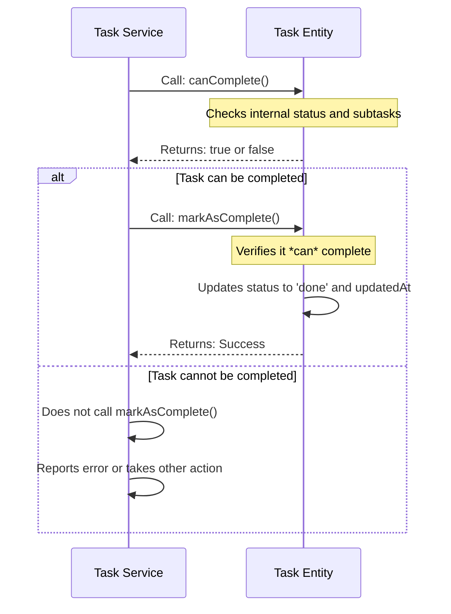

# Chapter 4: Task Entity

Welcome back! In [Chapter 3: Tagged Task Lists System](03_tagged_task_lists_system_.md), we learned how to organize our tasks into different, isolated lists using tags, keeping our project neat and tidy. But what *is* a task, really? And how does `claude-task-master` make sure every task behaves correctly, no matter where it comes from? That's what we'll explore with the **Task Entity**.

## What Problem Does the Task Entity Solve?

Imagine you have a list of tasks, perhaps on a whiteboard or in a simple text file. Each task has a title, a description, and a status (like "pending" or "done"). Now, what if you want to mark a task as "done"? You might simply erase "pending" and write "done."

But in a complex system like `claude-task-master`, there are rules!
*   Can you mark a task as "done" if it has uncompleted subtasks? Probably not.
*   Can you mark a task as "done" if it's currently "blocked"? Unlikely.
*   If a task is "done," can it suddenly become "pending" again? Maybe, but usually not without careful thought.

If every part of your project (the command-line interface, the MCP Server, internal tools) had to remember *all* these rules every time it touched a task, things would get very messy, and errors would be common.

The **Task Entity** solves this by acting like a **"smart task object"** or a **"self-managing blueprint"** for a task. Instead of just being a bundle of data, it's a special kind of object that holds both:
1.  **All the task's data**: ID, title, description, status, subtasks, etc.
2.  **All the task's rules**: The logic that dictates how the task can behave and change.

This ensures that tasks *always* follow the rules, no matter who tries to interact with them.

## The Task Entity: Your Project's Self-Managing Task Blueprint

Think of a `Task Entity` as a highly detailed blueprint for a single task. This blueprint isn't just a picture; it also includes all the instructions and conditions for how that task can be built, modified, and completed.

Here are the key ideas:

*   **Data Holder**: It stores all the properties of a task, like its unique `id`, `title`, `description`, current `status` (e.g., 'pending', 'in-progress', 'done'), `priority`, `dependencies`, and any `subtasks`.
*   **Rule Enforcer**: It contains methods (functions) that embody the "business logic" or rules for a task. For example:
    *   `canComplete()`: A method that tells you if a task is *allowed* to be marked as complete right now (e.g., checks if all subtasks are done).
    *   `markAsComplete()`: A method that changes the task's status to 'done', but *only if* `canComplete()` says it's okay.
    *   `updateStatus(newStatus)`: A method that changes the task's status, but it will check if the `newStatus` is valid and if the transition is allowed (e.g., can't go from 'done' directly to 'pending').
*   **Consistency**: By centralizing these rules within the `Task Entity` itself, we guarantee that every task in `claude-task-master` behaves consistently. Whether you use the command-line, an AI assistant, or any other tool, the rules for task completion or status changes are always the same.

## Use Case: Safely Completing a Task

Let's say you want to mark a task as complete. Instead of just changing a `status` property directly, you interact with the `Task Entity` to ensure all rules are followed.

### 1. Creating a Task Entity

First, you would load your task data and turn it into a `Task Entity` object.

```typescript
// (Imagine this data comes from your tasks.json file)
const taskData = {
  id: "1",
  title: "Implement login page",
  description: "Create the user login interface.",
  status: "in-progress",
  priority: "high",
  dependencies: [],
  details: "",
  testStrategy: "",
  subtasks: [
    { id: 1, parentId: "1", title: "Design UI", status: "done", description: "", priority: "medium", details: "", testStrategy: "" },
    { id: 2, parentId: "1", title: "Connect to API", status: "pending", description: "", priority: "high", details: "", testStrategy: "" },
  ],
};

import { TaskEntity } from '@task-master/tm-core/entities/task.entity.js';

// Create a 'smart' Task Entity from your data
const loginTask = new TaskEntity(taskData);

console.log(`Task '${loginTask.title}' current status: ${loginTask.status}`);
// Output: Task 'Implement login page' current status: in-progress
```
**Explanation**: We take a plain JavaScript object representing a task and pass it to the `TaskEntity` constructor. The `TaskEntity` then takes this data, validates it, and creates a "smart" object that now holds both the data and all its rules. Notice how subtask IDs are numbers in the `Subtask` interface and `parentId` is a string, which the `TaskEntity` correctly handles.

### 2. Checking if a Task Can Be Completed (`canComplete()`)

Before trying to mark a task as complete, it's a good idea to ask the `Task Entity` if it *can* be completed. This method will check all the rules (e.g., are all subtasks done?).

```typescript
// Continuing from the previous example with loginTask

// Ask the Task Entity if it can be completed
const canItBeDone = loginTask.canComplete();

console.log(`Can task '${loginTask.title}' be marked as complete? ${canItBeDone}`);
// Output: Can task 'Implement login page' be marked as complete? false
```
**Explanation**: The `canComplete()` method automatically checks the task's current status and its subtasks. Since one subtask ("Connect to API") is still "pending," the `Task Entity` correctly reports that the main task cannot be completed yet. This prevents errors and ensures tasks are only marked as done when they truly are.

### 3. Marking a Task as Complete (`markAsComplete()`)

Once `canComplete()` returns `true`, you can then confidently tell the `Task Entity` to mark itself as complete. If `canComplete()` was `false`, `markAsComplete()` would throw an error, preventing an invalid state.

Let's imagine we updated the "Connect to API" subtask to "done" (we'll see how to do that in [Chapter 5: Task Service (Business Logic Layer)](05_task_service__business_logic_layer__.md)).

```typescript
// (Assuming subtask 'Connect to API' is now 'done')
loginTask.subtasks[1].status = 'done'; // Directly changing for demo, but TaskService would do this

console.log(`Updated subtask status. Can task now be completed? ${loginTask.canComplete()}`);
// Output: Updated subtask status. Can task now be completed? true

try {
  loginTask.markAsComplete(); // Now this should work!
  console.log(`Task '${loginTask.title}' status is now: ${loginTask.status}`);
  // Output: Task 'Implement login page' status is now: done
} catch (error) {
  console.error("Failed to mark task as complete:", error.message);
}
```
**Explanation**: After the subtask is marked "done," `canComplete()` now returns `true`. This allows `markAsComplete()` to proceed, changing the main task's status to "done" and updating its `updatedAt` timestamp. This safe, rule-based approach is a core benefit of the `Task Entity`.

## How It Works Under the Hood: Self-Contained Logic

When you interact with a `Task Entity`, you're essentially asking that specific "smart task object" to perform an action or give you information based on its internal data and rules.

Here's a simplified sequence of how this might happen when a `Task Service` (which we'll cover in the next chapter) wants to complete a task:



Let's break down the key parts of the `Task Entity` code. You can find this in `packages/tm-core/src/entities/task.entity.ts`.

### 1. The `TaskEntity` Constructor: Data & Initial Validation

When you create a `new TaskEntity()`, the constructor immediately validates the basic properties of the task. If anything is missing or invalid (like an empty title or an unknown status), it will throw an error right away.

```typescript
// packages/tm-core/src/entities/task.entity.ts (simplified)
export class TaskEntity implements Task {
	readonly id: string;
	title: string;
	status: TaskStatus;
	subtasks: Subtask[];
    // ... other properties ...

	constructor(data: Task | (Omit<Task, 'id'> & { id: number | string })) {
		this.validate(data); // Ensures basic data is correct

		this.id = String(data.id); // Always store ID as string
		this.title = data.title;
		this.status = data.status;
		this.subtasks = (data.subtasks || []).map((subtask) => ({
			...subtask,
			id: Number(subtask.id), // Subtask IDs are numbers
			parentId: String(data.id)
		}));
        // ... assign other properties ...
	}

	private validate(data: Partial<Task>): void {
		if (data.id === undefined || data.title === undefined || data.description === undefined) {
			throw new TaskMasterError('Task requires ID, title, description', ERROR_CODES.VALIDATION_ERROR);
		}
		if (!this.isValidStatus(data.status)) {
			throw new TaskMasterError(`Invalid status: ${data.status}`, ERROR_CODES.VALIDATION_ERROR);
		}
        // ... more validation rules ...
	}

    private isValidStatus(status: any): status is TaskStatus {
		return ['pending', 'in-progress', 'done', 'deferred', 'cancelled', 'blocked', 'review'].includes(status);
	}
}
```
**Explanation**: The `constructor` takes the raw task data. Its first job is to call `this.validate(data)`. This private method checks if essential fields (like `id`, `title`, `description`) are present and if values like `status` and `priority` are valid according to predefined lists (e.g., 'pending', 'done'). If validation fails, it stops the creation of an invalid `TaskEntity` by throwing an error.

### 2. `canComplete()`: The Rule Checker

This method contains the logic to determine if a task is eligible for completion. It looks at the task's current `status` and the `status` of all its `subtasks`.

```typescript
// packages/tm-core/src/entities/task.entity.ts (simplified)
export class TaskEntity implements Task {
    // ... constructor and properties ...

	canComplete(): boolean {
		// Rule 1: Cannot complete if already done or cancelled
		if (this.status === 'done' || this.status === 'cancelled') {
			return false;
		}

		// Rule 2: Cannot complete if blocked
		if (this.status === 'blocked') {
			return false;
		}

		// Rule 3: All subtasks must be complete (done or cancelled)
		const allSubtasksComplete = this.subtasks.every(
			(subtask) => subtask.status === 'done' || subtask.status === 'cancelled'
		);

		return allSubtasksComplete;
	}
}
```
**Explanation**: `canComplete()` checks several conditions. First, if the task is already 'done' or 'cancelled', there's nothing more to do. Second, if it's 'blocked', it can't be completed. Third, and very important, it iterates through all `subtasks` and makes sure *every single one* is either 'done' or 'cancelled'. Only if all these conditions are met does it return `true`.

### 3. `markAsComplete()`: The Action Taker

This method is responsible for actually changing the task's status, but it *always* defers to `canComplete()` first.

```typescript
// packages/tm-core/src/entities/task.entity.ts (simplified)
export class TaskEntity implements Task {
    // ... constructor, properties, canComplete() ...

	markAsComplete(): void {
		if (!this.canComplete()) { // First, check if it's allowed
			throw new TaskMasterError(
				'Task cannot be marked as complete',
				ERROR_CODES.TASK_STATUS_ERROR,
                // Additional data to help debug the error
				{ taskId: this.id, currentStatus: this.status, hasIncompleteSubtasks: true }
			);
		}

		this.status = 'done'; // If allowed, change status
		this.updatedAt = new Date().toISOString(); // Update timestamp
	}
}
```
**Explanation**: `markAsComplete()` starts by calling `this.canComplete()`. If `canComplete()` returns `false`, it immediately throws a `TaskMasterError`, explaining why the task cannot be completed. This prevents the task from entering an invalid state. If `canComplete()` returns `true`, then the `status` is safely changed to 'done', and the `updatedAt` timestamp is updated.

### 4. `updateStatus(newStatus: TaskStatus)`: Flexible Status Changes

This method allows changing the task's status to other valid states, again with built-in rules.

```typescript
// packages/tm-core/src/entities/task.entity.ts (simplified)
import { TaskStatus } from '../types/index.js'; // Import TaskStatus type

export class TaskEntity implements Task {
    // ... constructor, properties, canComplete(), markAsComplete() ...

    updateStatus(newStatus: TaskStatus): void {
        if (!this.isValidStatus(newStatus)) { // Validate the new status value
            throw new TaskMasterError(
                `Invalid status: ${newStatus}`,
                ERROR_CODES.VALIDATION_ERROR
            );
        }

        // Business rule: Cannot move from done to pending
        if (this.status === 'done' && newStatus === 'pending') {
            throw new TaskMasterError(
                'Cannot move completed task back to pending',
                ERROR_CODES.TASK_STATUS_ERROR
            );
        }

        this.status = newStatus; // If valid, update status
        this.updatedAt = new Date().toISOString();
    }
}
```
**Explanation**: The `updateStatus` method first validates if the `newStatus` itself is a recognized `TaskStatus` (like 'pending', 'in-progress', etc.). Then, it applies specific business rules, such as preventing a task that is 'done' from being directly moved back to 'pending'. If all checks pass, the status is updated, and the `updatedAt` timestamp is recorded.

## Conclusion

The `Task Entity` is a cornerstone of `claude-task-master`'s robust design. By encapsulating both a task's data and its governing business rules into a single "smart object," it guarantees that tasks always behave consistently and correctly. This prevents invalid states, simplifies interactions, and makes the entire system more reliable and easier to extend.

Now that we understand the individual task blueprint, we'll see how these `Task Entities` are managed and manipulated by the central logic in [Chapter 5: Task Service (Business Logic Layer)](05_task_service__business_logic_layer__.md).

---

<sub><sup>Generated by [AI Codebase Knowledge Builder](https://github.com/The-Pocket/Tutorial-Codebase-Knowledge).</sup></sub> <sub><sup>**References**: [[1]](https://github.com/eyaltoledano/claude-task-master/blob/b7f32eac5a1eb90ec93cc4597def716335dc4b5f/packages/tm-core/POC-STATUS.md), [[2]](https://github.com/eyaltoledano/claude-task-master/blob/b7f32eac5a1eb90ec93cc4597def716335dc4b5f/packages/tm-core/src/entities/task.entity.ts), [[3]](https://github.com/eyaltoledano/claude-task-master/blob/b7f32eac5a1eb90ec93cc4597def716335dc4b5f/packages/tm-core/src/types/index.ts)</sup></sub>