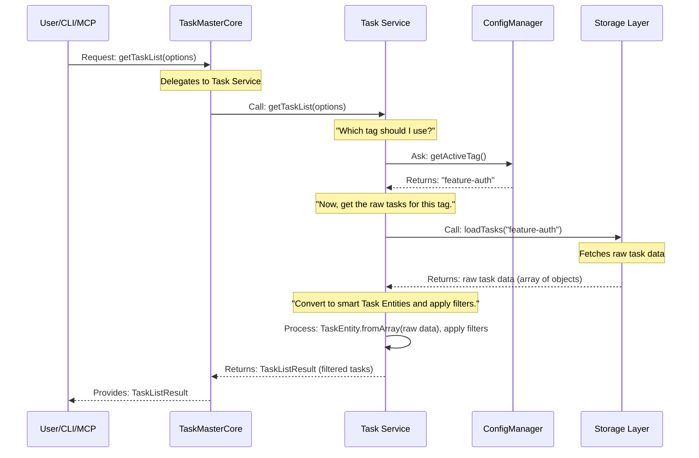

# Chapter 5: Task Service (Business Logic Layer)

In [Chapter 4: Task Entity](04_task_entity___.md), we got up close and personal with the `Task Entity`. We learned that it's more than just data; it's a "smart blueprint" that knows its own rules for how it can change status or be completed. But imagine you have a whole team of these smart tasks. Who manages the *entire project*? Who decides how to find the *next* task to work on, or how to list all pending tasks across the board?

That's the job of the **Task Service**.

## What Problem Does the Task Service Solve?

Think of the `Task Service` as the **project manager** for all your tasks in `claude-task-master`. Just like a human project manager, it doesn't do the individual building work (that's what individual [Task Entities](04_task_entity___.md) do), nor does it worry about where the building materials are stored (that's the job of the [Storage Layer (IStorage)](07_storage_layer__istorage___.md)).

Instead, the `Task Service` focuses purely on the **"what" and "how" of managing tasks at a higher level**:
*   **What are all the tasks that are 'pending' and 'high priority'?** (Filtering)
*   **Which task should I work on next, considering dependencies and priorities?** (Sorting/Logic)
*   **How do I update a task's status from 'pending' to 'in-progress' safely?** (Coordinating actions)
*   **Where do I get the tasks from?** (It asks the [Storage Layer (IStorage)](07_storage_layer__istorage___.md))
*   **What project settings should I use?** (It asks the [Configuration Manager](08_configuration_manager___.md))

Without the `Task Service`, every part of `claude-task-master` (like the command-line interface or the [MCP Server](01_mcp_server__model_context_protocol___.md)) would have to know all these details, making the system messy and hard to change. The `Task Service` centralizes this "business logic" and coordination.

## The Task Service: Your Project's Task Manager

The `Task Service` is the core **business logic layer** for tasks. It orchestrates interactions between different parts of the system to perform complex task operations.

Here's what it does:

1.  **Orchestrates Operations**: It acts as the central coordinator for tasks. When [TaskMasterCore (Facade Layer)](02_taskmastercore__facade_layer___.md) (our "smart waiter") receives a request like "list all tasks," it hands it off to the `Task Service`.
2.  **Applies Business Rules**: It contains the logic for advanced task management, such as:
    *   **Filtering**: Finding tasks based on status, priority, tags, or text search.
    *   **Sorting**: Determining the order of tasks, especially for `getNextTask`.
    *   **Delegating Storage**: It knows *how* to ask the [Storage Layer (IStorage)](07_storage_layer__istorage___.md) to load or save tasks, but it doesn't care about the *details* of storage (e.g., whether it's a file or a database).
    *   **Utilizing Configurations**: It uses the [Configuration Manager](08_configuration_manager___.md) to get project settings like the active task tag.
3.  **Works with Task Entities**: Once it loads raw task data from storage, it often converts them into "smart" [Task Entities](04_task_entity___.md) to leverage their built-in validation and business rules.

## Use Case: Getting a Filtered List of Tasks

Let's walk through how you'd get a list of all "pending" and "in-progress" tasks using the `Task Service` (via [TaskMasterCore (Facade Layer)](02_taskmastercore__facade_layer___.md)).

### 1. Initializing the Task Service (via TaskMasterCore)

You typically don't create `TaskService` directly. Instead, [TaskMasterCore (Facade Layer)](02_taskmastercore__facade_layer___.md) handles its setup, passing it the necessary [Configuration Manager](08_configuration_manager___.md).

```typescript
import { createTaskMasterCore } from '@task-master/tm-core';

const myProjectPath = '/Users/yourname/my-cool-project'; // Your project folder

async function getMyPendingTasks() {
  // TaskMasterCore initializes the Task Service and other components
  const taskMaster = await createTaskMasterCore({
    projectPath: myProjectPath,
  });

  // Now, we can ask TaskMasterCore to get the task list,
  // and it will delegate to the Task Service.
  const result = await taskMaster.getTaskList({
    filter: {
      status: ['pending', 'in-progress'], // We want tasks that are pending or in-progress
      priority: 'high',                   // And only those with high priority
      search: 'login'                     // And contain 'login' in title/description
    }
  });

  console.log(`Found ${result.filtered} active tasks related to 'login':`);
  result.tasks.forEach(task => {
    console.log(`- [${task.status}] ${task.title} (ID: ${task.id})`);
  });

  await taskMaster.close(); // Clean up when done
}

getMyPendingTasks();
```
**Explanation**: In this example, we ask `taskMaster` (our [TaskMasterCore](02_taskmastercore__facade_layer___.md) instance) for a task list. We provide `options.filter` to tell it exactly what kind of tasks we're interested in. The `Task Service` then takes these filter options and applies its internal logic to find the matching tasks.

## How It Works Under the Hood: The Orchestrator in Action

When `TaskMasterCore` asks the `Task Service` for a list of tasks, here's a simplified sequence of how the `Task Service` orchestrates everything:



Let's dive into the code from `packages/tm-core/src/services/task-service.ts` to see how this happens.

### 1. Initializing `TaskService`

The `TaskService` needs a [Configuration Manager](08_configuration_manager___.md) to know about project settings and then creates the appropriate [Storage Layer (IStorage)](07_storage_layer__istorage___.md) based on those settings.

```typescript
// packages/tm-core/src/services/task-service.ts (simplified)
import { ConfigManager } from '../config/config-manager.js';
import { StorageFactory } from '../storage/storage-factory.js';
import type { IStorage } from '../interfaces/storage.interface.js';

export class TaskService {
	private configManager: ConfigManager;
	private storage: IStorage; // Our link to the storage layer

	constructor(configManager: ConfigManager) {
		this.configManager = configManager;
		this.storage = null as any; // Will be set during initialize
	}

	async initialize(): Promise<void> {
		// 1. Get storage configuration from the ConfigManager
		const storageConfig = this.configManager.getStorageConfig();
		const projectRoot = this.configManager.getProjectRoot();

		// 2. Use StorageFactory to create the correct storage type
		this.storage = StorageFactory.createFromStorageConfig(
			storageConfig,
			projectRoot
		);

		// 3. Initialize the selected storage
		await this.storage.initialize();
	}
}
```
**Explanation**: The `TaskService` constructor receives the `ConfigManager` so it can access project settings. The `initialize()` method is crucial: it asks the `ConfigManager` for storage details, then uses the `StorageFactory` (a helper that picks the right storage type, like reading from files or talking to an API) to set up the actual `storage` component. This way, `TaskService` doesn't need to know *how* to store things, just *that* it has a `storage` component to ask.

### 2. `getTaskList()`: The Orchestration Hub

This is where the magic happens for listing tasks. It pulls together information from the `ConfigManager`, gets data from the `storage`, converts it to [Task Entities](04_task_entity___.md), and applies filtering logic.

```typescript
// packages/tm-core/src/services/task-service.ts (simplified)
import { TaskEntity } from '../entities/task.entity.js'; // Our smart task blueprint
import type { TaskListResult, GetTaskListOptions } from '../types/index.js';

export class TaskService {
    // ... constructor and initialize method ...

	async getTaskList(options: GetTaskListOptions = {}): Promise<TaskListResult> {
		// 1. Determine which tag to use (from options or active config)
		const activeTag = this.configManager.getActiveTag();
		const tag = options.tag || activeTag;

		// 2. Load raw tasks from storage for the determined tag
		const rawTasks = await this.storage.loadTasks(tag);

		// 3. Convert raw data to 'smart' TaskEntity objects
		const taskEntities = TaskEntity.fromArray(rawTasks);

		// 4. Apply filters if provided in options
		let filteredEntities = taskEntities;
		if (options.filter) {
			filteredEntities = this.applyFilters(taskEntities, options.filter);
		}

		// 5. Convert filtered TaskEntity objects back to plain objects for return
		let tasks = filteredEntities.map((entity) => entity.toJSON());

		// 6. Return the result
		return { tasks, total: rawTasks.length, filtered: filteredEntities.length, tag };
	}
    // ... other methods ...
}
```
**Explanation**:
1.  It first checks which task `tag` (like `master` or `feature-auth`) it should work with, getting the default from the `ConfigManager` if not specified.
2.  It then asks the `this.storage` object to `loadTasks` for that tag. The storage just gives back raw task data.
3.  Next, it converts these raw tasks into `TaskEntity` objects. This allows us to use all the smart rules we learned about in [Chapter 4: Task Entity](04_task_entity___.md).
4.  If the user provided any `filter` options (like `status: 'pending'`), the `TaskService` calls its `applyFilters` method (which we'll see next) to narrow down the list.
5.  Finally, it converts the filtered `TaskEntity` objects back into simple data objects and returns them as a `TaskListResult`.

### 3. `applyFilters()`: The Filtering Logic

This private method within `TaskService` takes a list of `TaskEntity` objects and applies all the requested filters.

```typescript
// packages/tm-core/src/services/task-service.ts (simplified)
import type { TaskFilter } from '../types/index.js'; // Defines the filter structure

export class TaskService {
    // ... getTaskList() and other methods ...

	private applyFilters(tasks: TaskEntity[], filter: TaskFilter): TaskEntity[] {
		return tasks.filter((task) => {
			// Example: Status filter
			if (filter.status) {
				const statuses = Array.isArray(filter.status) ? filter.status : [filter.status];
				if (!statuses.includes(task.status)) {
					return false; // Exclude if status doesn't match
				}
			}

			// Example: Priority filter
			if (filter.priority) {
				const priorities = Array.isArray(filter.priority) ? filter.priority : [filter.priority];
				if (!priorities.includes(task.priority)) {
					return false; // Exclude if priority doesn't match
				}
			}

			// Example: Search filter (checks title, description, details)
			if (filter.search) {
				const searchLower = filter.search.toLowerCase();
				const inTitle = task.title.toLowerCase().includes(searchLower);
				const inDescription = task.description.toLowerCase().includes(searchLower);
				// ... check other fields ...

				if (!inTitle && !inDescription) { // Simplified
					return false; // Exclude if search term not found
				}
			}

			// ... (many other filter types like tags, assignee, complexity, hasSubtasks) ...

			return true; // Keep task if all applied filters pass
		});
	}
}
```
**Explanation**: The `applyFilters` method goes through each `TaskEntity` in the list. For every filter condition provided in `TaskFilter` (like `status`, `priority`, `search`), it checks if the task matches. If a task fails *any* filter, it's immediately excluded. Only tasks that pass *all* active filters are kept in the list. This is a core piece of the "business logic" that `TaskService` manages.

### 4. `getNextTask()`: Complex Task Prioritization

This method showcases more advanced business logic, determining the single most important task to work on next, considering subtasks and dependencies.

```typescript
// packages/tm-core/src/services/task-service.ts (simplified)
export class TaskService {
    // ... other methods ...

    async getNextTask(tag?: string): Promise<Task | null> {
        // 1. Get all relevant tasks (pending, in-progress, done)
        const result = await this.getTaskList({ tag, filter: { status: ['pending', 'in-progress', 'done'] } });
        const allTasks = result.tasks;

        // 2. Build a list of all completed task/subtask IDs
        const completedIds = new Set<string>();
        allTasks.forEach(t => { /* ... logic to add completed IDs ... */ });

        // 3. Find eligible subtasks from 'in-progress' parent tasks first
        const candidateSubtasks = [];
        allTasks
            .filter(t => t.status === 'in-progress' && t.subtasks?.length)
            .forEach(parent => {
                parent.subtasks!.forEach(st => {
                    // ... complex logic for subtask eligibility and dependencies ...
                    if (st.status === 'pending') candidateSubtasks.push(/* subtask data */);
                });
            });

        if (candidateSubtasks.length > 0) {
            candidateSubtasks.sort(/* ... sorting by priority, dependencies ... */);
            return candidateSubtasks[0]; // Return the top subtask
        }

        // 4. If no eligible subtasks, fall back to top-level tasks
        const eligibleTasks = allTasks.filter(task => {
            // ... logic for top-level task eligibility and dependencies ...
            return task.status === 'pending';
        });

        if (eligibleTasks.length === 0) return null;

        eligibleTasks.sort(/* ... sorting by priority, dependencies ... */);
        return eligibleTasks[0]; // Return the top top-level task
    }
}
```
**Explanation**: The `getNextTask` method is a great example of advanced business logic. It first gathers all tasks. Then, it meticulously identifies all completed tasks and subtasks to understand dependencies. It prioritizes finding eligible subtasks within currently "in-progress" parent tasks. If there are any, it sorts them by priority and other factors to pick the *most important* one. Only if no subtasks are eligible does it then look for eligible top-level tasks and applies a similar sorting logic. This intricate decision-making is a prime example of the `Task Service`'s role as the project manager.

### 5. `updateTaskStatus()`: Delegating to Storage

When it's time to actually save a change, the `Task Service` delegates this to the `storage` component.

```typescript
// packages/tm-core/src/services/task-service.ts (simplified)
import type { TaskStatus } from '../types/index.js';

export class TaskService {
    // ... getTaskList() and other methods ...

	async updateTaskStatus(
		taskId: string | number,
		newStatus: TaskStatus,
		tag?: string
	): Promise<{ success: boolean; oldStatus: TaskStatus; newStatus: TaskStatus; taskId: string; }> {
		if (!this.storage) {
			throw new Error('Storage not initialized'); // Simplified error handling
		}

		const activeTag = tag || this.getActiveTag();
		const taskIdStr = String(taskId);

		// The Task Service delegates the actual saving/updating to the storage layer
		return await this.storage.updateTaskStatus(
			taskIdStr,
			newStatus,
			activeTag
		);
	}
}
```
**Explanation**: For operations that modify tasks, like `updateTaskStatus`, the `Task Service` figures out the correct `tag` and then simply calls `this.storage.updateTaskStatus()`. This means the `Task Service` trusts the `Storage Layer` to handle the specific details of *how* to change that status in the underlying data (e.g., editing a `tasks.json` file or sending an API request to a backend). This maintains a clean separation: `Task Service` defines *what* needs to be done, `Storage Layer` handles *how* it's done.

## Conclusion

The `Task Service` is the central "project manager" of `claude-task-master`. It's the brain that orchestrates complex task operations, applying all the necessary business rules for filtering, sorting, and coordinating with the [Configuration Manager](08_configuration_manager___.md) and [Storage Layer (IStorage)](07_storage_layer__istorage___.md). By keeping this core logic in one place, `claude-task-master` remains organized, flexible, and robust.

In our next chapter, we'll look at another crucial component for interacting with the outside world: [AI Provider (IAIProvider)](06_ai_provider__iaiprovider___.md).

---

<sub><sup>Generated by [AI Codebase Knowledge Builder](https://github.com/The-Pocket/Tutorial-Codebase-Knowledge).</sup></sub> <sub><sup>**References**: [[1]](https://github.com/eyaltoledano/claude-task-master/blob/b7f32eac5a1eb90ec93cc4597def716335dc4b5f/packages/tm-core/POC-STATUS.md), [[2]](https://github.com/eyaltoledano/claude-task-master/blob/b7f32eac5a1eb90ec93cc4597def716335dc4b5f/packages/tm-core/docs/listTasks-architecture.md), [[3]](https://github.com/eyaltoledano/claude-task-master/blob/b7f32eac5a1eb90ec93cc4597def716335dc4b5f/packages/tm-core/src/services/index.ts), [[4]](https://github.com/eyaltoledano/claude-task-master/blob/b7f32eac5a1eb90ec93cc4597def716335dc4b5f/packages/tm-core/src/services/task-service.ts)</sup></sub>