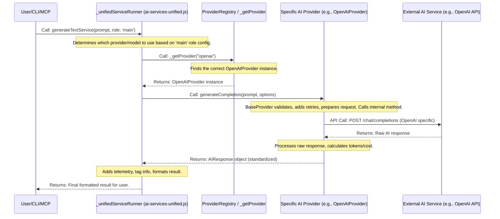

# Chapter 6: AI Provider (IAIProvider)

Welcome back! In [Chapter 5: Task Service (Business Logic Layer)](05_task_service__business_logic_layer___.md), we explored how the `Task Service` acts as a project manager, coordinating tasks and applying business rules. Now, let's turn our attention to how `claude-task-master` talks to the incredibly smart tools outside our project: **AI models**! This is where the **AI Provider (IAIProvider)** comes in.

## What Problem Does the AI Provider Solve?

Imagine you have a team of highly skilled virtual assistants, each specialized in generating text, summarizing information, or even writing code. You have assistants from company A (like Claude), company B (like OpenAI's GPT models), and company C (like Perplexity).

Each of these companies has its own unique way of being asked questions and delivering answers. For example, to ask Claude a question, you might need to use specific "Anthropic" software. To ask OpenAI, you use different "OpenAI" software. If `claude-task-master` wanted to use *all* these different AIs, it would have to learn and manage each company's specific software, their unique settings, how they handle errors, and how to retry if something goes wrong. This would be a huge mess!

The **AI Provider (IAIProvider)** is like a **universal adapter or a "translation hub"** for all these different AI services. It solves this problem by:

1.  **Standardizing Communication**: Providing a single, consistent way for `claude-task-master` to talk to *any* AI model, regardless of its company. You speak one language, and the AI Provider handles the translation to the specific AI's language.
2.  **Hiding Complexity**: You don't need to know the specific technical details of how Claude or OpenAI works. The AI Provider takes care of it.
3.  **Handling Common Issues**: It automatically deals with common problems like network glitches (by retrying your request) or knowing what to do if an AI model makes a mistake (error handling).
4.  **Making it Easy to Switch**: Because of this standardization, `claude-task-master` can easily switch between different AI models, or even combine their capabilities, without changing much code.

This means `claude-task-master` can leverage the best AI for any job without getting bogged down in technical differences.

## Your Project's Universal AI Translator: The IAIProvider

At its heart, the `IAIProvider` is an **interface**. In programming, an interface is like a **contract or a blueprint** that specifies a set of functions (methods) that any class claiming to be an `IAIProvider` *must* implement.

Here are the key ideas:

*   **The Contract (`IAIProvider` Interface)**: This defines a common set of actions that any AI service can perform, like `generateCompletion` (generate text), `calculateTokens` (count words), or `getAvailableModels` (see what models are offered). It's the "universal language."
*   **Specific Translators (Provider Implementations)**: For each actual AI service (e.g., OpenAI, Anthropic), there's a specific class (like `OpenAIProvider`, `AnthropicAIProvider`) that fulfills the `IAIProvider` contract. These classes know how to take the universal request and translate it into the specific API call for their AI service.
*   **Common Helpers (`BaseAIProvider` / `BaseProvider`)**: To avoid repeating code, there's a base class (`BaseAIProvider` or `BaseProvider` in our code) that handles common tasks for *all* AI providers. This includes things like managing retries, basic input validation, and consistent error reporting. Think of it as a shared toolkit for all the translators.

## Use Case: Generating a Task Description with Any AI

Let's imagine you want to generate a detailed description for a new task using AI. You don't care *which* AI, just that it gets the job done. `claude-task-master` will use the AI Provider system to do this.

You typically won't interact with `IAIProvider` directly. Instead, you'll call a unified service function (like `generateTextService`) which then uses the `IAIProvider` behind the scenes.

Here's how you might call it (this is a simplified example of how internal `claude-task-master` code would call it):

```javascript
// scripts/modules/ai-services-unified.js is the entry point
import { generateTextService } from './ai-services-unified.js';

async function generateTaskDescription(taskTitle) {
  console.log(`Asking AI to generate description for: "${taskTitle}"`);

  try {
    const result = await generateTextService({
      role: 'main', // Use the 'main' configured AI provider
      prompt: `Generate a detailed and actionable description for a task titled "${taskTitle}". Include key steps.`,
      systemPrompt: 'You are a helpful project manager AI assistant.',
      commandName: 'add-task-with-ai', // For logging and telemetry
      outputType: 'cli', // Output for command-line interface
    });

    console.log('\n--- AI Generated Description ---');
    console.log(`Using provider: ${result.providerName}`);
    console.log(`Using model: ${result.modelId}`);
    console.log(result.mainResult);
    console.log('------------------------------');

  } catch (error) {
    console.error('Failed to generate description:', error.message);
  }
}

generateTaskDescription('Implement user login with OAuth');
```
**Explanation**:
1.  We `import` `generateTextService`, which is the unified entry point for AI text generation.
2.  We call `generateTextService` with a `prompt` (our request to the AI), a `role` (telling it which configured AI to try first, e.g., 'main' or 'research'), and some other parameters.
3.  Crucially, we *don't* specify `OpenAI`, `Anthropic`, or any specific AI here. The `AI Provider` system handles finding and using the correct AI behind the scenes!
4.  The `result` will contain the generated text and information about which provider and model were actually used.

## How It Works Under the Hood: The AI Dispatcher

When you call `generateTextService`, a lot happens to ensure the right AI provider is used, and the request is handled reliably.

Here's a simplified sequence of events:



Let's look at some key code pieces that make this possible.

### 1. The `IAIProvider` Interface (`packages/tm-core/src/interfaces/ai-provider.interface.ts`)

This is the "contract" that all AI providers must follow.

```typescript
// packages/tm-core/src/interfaces/ai-provider.interface.ts (simplified)

// ... (other interfaces like AIOptions, AIResponse, AIModel, ProviderInfo) ...

export interface IAIProvider {
	generateCompletion(prompt: string, options?: AIOptions): Promise<AIResponse>;
	generateStreamingCompletion(prompt: string, options?: AIOptions): AsyncIterator<Partial<AIResponse>>;
	calculateTokens(text: string, model?: string): number;
	getName(): string;
	getModel(): string;
	setModel(model: string): void;
	isAvailable(): Promise<boolean>;
	getProviderInfo(): ProviderInfo;
	validateCredentials(): Promise<boolean>;
	initialize(): Promise<void>;
	close(): Promise<void>;
    // ... many more methods for a complete contract ...
}
```
**Explanation**: This `IAIProvider` interface defines the *minimum* set of functions any AI provider must have. Notice `generateCompletion` (for one-off text generation) and `generateStreamingCompletion` (for real-time, word-by-word responses). By implementing this interface, different AI services can be swapped out easily.

### 2. The `BaseProvider` for Common Logic (`packages/tm-core/src/providers/ai/base-provider.ts`)

This abstract class handles common tasks, so individual AI providers don't have to rewrite them.

```typescript
// packages/tm-core/src/providers/ai/base-provider.ts (simplified)
import type { AIOptions, AIResponse, IAIProvider } from '../../interfaces/ai-provider.interface.js';
import { TaskMasterError, ERROR_CODES } from '../../errors/task-master-error.js';

export abstract class BaseProvider implements IAIProvider {
	protected readonly apiKey: string;
	protected model: string;
    // ... constructor ...

	// Public generateCompletion method (the universal adapter entry point)
	async generateCompletion(prompt: string, options?: AIOptions): Promise<AIResponse> {
		// 1. Input Validation
		const validation = this.validateInput(prompt, options);
		if (!validation.valid) { throw new TaskMasterError(validation.error || 'Invalid input', ERROR_CODES.VALIDATION_ERROR); }

		// 2. Prepare request (e.g., merge default options)
		const prepared = this.prepareRequest(prompt, options);

		// 3. Retry Logic
		let lastError: Error | undefined;
		for (let attempt = 1; attempt <= this.getMaxRetries(); attempt++) {
			try {
				const startTime = Date.now();
				// 4. Call the *concrete* provider's internal method
				const result = await this.generateCompletionInternal(prepared.prompt, prepared.options);
				const duration = Date.now() - startTime;
				// 5. Handle and format response
				return this.handleResponse(result, duration, prepared);
			} catch (error) {
				lastError = error as Error;
				if (!this.shouldRetry(error, attempt)) { break; } // Don't retry non-retryable errors
				await this.sleep(this.calculateBackoffDelay(attempt)); // Wait before retrying
			}
		}
		// 6. All retries failed - handle final error
		this.handleError(lastError || new Error('Unknown error'));
	}

    // Abstract method: MUST be implemented by specific providers (e.g., OpenAIProvider)
	protected abstract generateCompletionInternal(prompt: string, options?: AIOptions): Promise<CompletionResult>;

    // ... other helper methods like validateInput, shouldRetry, calculateBackoffDelay, handleError ...

    // Other IAIProvider methods (abstract or implemented)
    abstract getName(): string;
    abstract getDefaultModel(): string;
    // ... (many more abstract methods that specific providers must implement) ...
}
```
**Explanation**:
The `BaseProvider` is a powerful example of the "Template Method" design pattern. The `generateCompletion` method outlines the *general steps* for any AI request: validate, prepare, retry, execute, handle response.
Crucially, it calls an `abstract` method `generateCompletionInternal`. This means `BaseProvider` defines the *flow*, but it leaves the *actual API call* (the "how to talk to OpenAI" part) to the specific AI provider (like `OpenAIProvider`) that extends `BaseProvider`. This way, all providers get automatic retries and error handling for free!

### 3. Registering and Retrieving Providers (`scripts/modules/ai-services-unified.js`)

This file is the dispatcher! It creates instances of all the specific AI Providers and has a way to get them.

```javascript
// scripts/modules/ai-services-unified.js (simplified)
import { AnthropicAIProvider, OpenAIProvider, PerplexityAIProvider } from '../../src/ai-providers/index.js'; // Import specific providers

// Create instances of all known AI providers
const PROVIDERS = {
	anthropic: new AnthropicAIProvider(),
	perplexity: new PerplexityAIProvider(),
	openai: new OpenAIProvider(),
	// ... other providers ...
};

// Helper function to get a specific provider instance by name
function _getProvider(providerName) {
	// First check our static list
	if (PROVIDERS[providerName]) {
		return PROVIDERS[providerName];
	}
	// ... (potentially check a dynamic registry too) ...
	return null; // Provider not found
}

// ... (other helper functions and the _unifiedServiceRunner) ...
```
**Explanation**:
This part of the code is like the reception desk for all AI providers. It creates an instance of each known AI provider (e.g., `new AnthropicAIProvider()`, `new OpenAIProvider()`). When `_unifiedServiceRunner` needs an AI, it calls `_getProvider(providerName)` to fetch the correct "translator" instance. Each of these specific provider classes (`AnthropicAIProvider`, `OpenAIProvider`, etc.) will extend the `BaseProvider` and implement the `IAIProvider` interface, providing their unique `generateCompletionInternal` logic.

### 4. The Unified Service Runner (`scripts/modules/ai-services-unified.js`)

This function orchestrates the entire AI request, from figuring out which AI to use to handling fallbacks.

```javascript
// scripts/modules/ai-services-unified.js (simplified)
import { log } from './utils.js';
// ... other imports ...

async function _unifiedServiceRunner(serviceType, params) {
    const { role: initialRole, prompt, ...rest } = params;
    log('info', `AI service call for role: ${initialRole}`);

    // Define a sequence of roles to try (e.g., 'main' then 'fallback')
    const sequence = initialRole === 'main' ? ['main', 'fallback', 'research'] : [initialRole, 'fallback']; // Simplified

    let lastError = null;

    for (const currentRole of sequence) {
        try {
            const roleConfig = _getRoleConfiguration(currentRole, rest.projectRoot);
            if (!roleConfig || !roleConfig.provider || !roleConfig.modelId) {
                log('warn', `Skipping role '${currentRole}': config missing.`);
                continue; // Try next role in sequence
            }

            // 1. Get the specific IAIProvider instance (e.g., OpenAIProvider)
            const provider = _getProvider(roleConfig.provider?.toLowerCase());
            if (!provider) {
                log('warn', `Skipping role '${currentRole}': Provider '${roleConfig.provider}' not supported.`);
                continue;
            }

            // 2. Resolve API key for the chosen provider
            const apiKey = _resolveApiKey(provider.getName(), rest.session, rest.projectRoot);
            // ... (Additional provider-specific config like base URLs, Vertex AI setup) ...

            const messages = [{ role: 'system', content: rest.systemPrompt || '' }, { role: 'user', content: prompt }];
            const callParams = { apiKey, modelId: roleConfig.modelId, messages, ...rest };

            // 3. Call the standardized AI Provider method (e.g., generateCompletion)
            const providerResponse = await provider[serviceType](callParams); // Calls IAIProvider.generateCompletion

            log('info', `AI call successful for role ${currentRole}`);

            // 4. Process and return the result (including telemetry, tag info)
            return {
                mainResult: providerResponse.content, // Access the standardized response
                providerName: provider.getName(),
                modelId: provider.getModel(),
                // ... other metadata ...
            };

        } catch (error) {
            log('error', `Failed for role ${currentRole}: ${error.message}`);
            lastError = error;
        }
    }

    throw lastError || new Error('All AI service roles failed.');
}

async function generateTextService(params) {
    return _unifiedServiceRunner('generateCompletion', params); // Maps to IAIProvider.generateCompletion
}
// ... (streamTextService, generateObjectService, etc. also call _unifiedServiceRunner) ...
```
**Explanation**:
The `_unifiedServiceRunner` is the traffic controller.
1.  It determines a sequence of AI roles to try (e.g., try 'main' first, then 'fallback').
2.  For each role, it retrieves the appropriate `IAIProvider` instance using `_getProvider`.
3.  It gathers all necessary configurations (API keys, models, system prompts).
4.  Then, it makes a **standardized call** to the chosen `provider`'s method (e.g., `provider.generateCompletion(callParams)`). This is the magic! It doesn't matter if `provider` is `OpenAIProvider` or `AnthropicAIProvider`; they all have a `generateCompletion` method because they implement `IAIProvider`.
5.  If one provider fails, it catches the error and tries the next provider in the `sequence` until one succeeds or all fail.
6.  Finally, it takes the standardized `AIResponse` object and prepares it for the user.

## Conclusion

The `AI Provider (IAIProvider)` is a crucial piece of `claude-task-master`'s architecture, acting as a **universal translator** for interacting with various AI services. By defining a common contract and encapsulating service-specific complexities, it enables `claude-task-master` to seamlessly leverage different AI models for tasks like text generation or structured data, while automatically handling retries and errors. This abstraction keeps our system flexible, robust, and ready for future AI advancements.

Next, we'll explore where all your tasks and project data actually live, in [Chapter 7: Storage Layer (IStorage)](07_storage_layer__istorage__.md).

---

<sub><sup>Generated by [AI Codebase Knowledge Builder](https://github.com/The-Pocket/Tutorial-Codebase-Knowledge).</sup></sub> <sub><sup>**References**: [[1]](https://github.com/eyaltoledano/claude-task-master/blob/b7f32eac5a1eb90ec93cc4597def716335dc4b5f/packages/tm-core/src/interfaces/ai-provider.interface.ts), [[2]](https://github.com/eyaltoledano/claude-task-master/blob/b7f32eac5a1eb90ec93cc4597def716335dc4b5f/packages/tm-core/src/providers/ai/base-provider.ts), [[3]](https://github.com/eyaltoledano/claude-task-master/blob/b7f32eac5a1eb90ec93cc4597def716335dc4b5f/packages/tm-core/src/providers/index.ts), [[4]](https://github.com/eyaltoledano/claude-task-master/blob/b7f32eac5a1eb90ec93cc4597def716335dc4b5f/scripts/modules/ai-services-unified.js), [[5]](https://github.com/eyaltoledano/claude-task-master/blob/b7f32eac5a1eb90ec93cc4597def716335dc4b5f/src/ai-providers/index.js)</sup></sub>