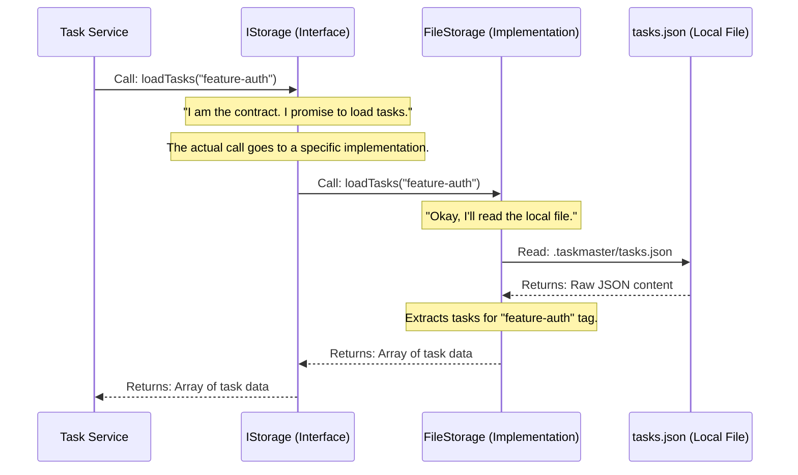

# Chapter 7: Storage Layer (IStorage)

Welcome back! In [Chapter 6: AI Provider (IAIProvider)](06_ai_provider__iaiprovider___.md), we learned how `claude-task-master` uses a smart "universal translator" to talk to different AI models. Now, let's explore an equally important concept: where all your precious tasks and project data actually *live* and how `claude-task-master` manages them. This is the role of the **Storage Layer (IStorage)**.

## What Problem Does the Storage Layer Solve?

Imagine `claude-task-master` is a busy office manager, and your tasks are important documents. These documents need to be kept safe, organized, and easily retrievable.

Now, imagine you have two options for storing these documents:
1.  **A physical filing cabinet** in your office. You open a drawer, find the right folder, and put the document inside.
2.  **A cloud storage service** like Google Drive. You upload the document to a specific folder online.

From the office manager's perspective, the important thing is that the document is *saved* and can be *retrieved*. They shouldn't have to know the intricate details of *how* the filing cabinet works (e.g., what brand it is, how many drawers it has) or *how* the cloud service handles data (e.g., which servers it uses). They just need a consistent way to "save this" and "get me that."

This is exactly the problem the **Storage Layer (IStorage)** solves for `claude-task-master`. It acts like a **secure filing cabinet** for your tasks. Its job is *only* to save and load your task data, without knowing any of the complicated "business rules" about tasks (like if a task can be completed, which is handled by the [Task Entity](04_task_entity___.md) and [Task Service](05_task_service__business_logic_layer___.md)).

Whether your tasks are stored in a simple JSON file on your computer (like our physical filing cabinet) or in a remote online database (like our cloud service), the Storage Layer provides a **consistent, unified way** to interact with them. This means the rest of `claude-task-master` can ask for tasks without caring about the underlying storage technology.

## The Storage Layer: Your Project's Secure Filing Cabinet

The `IStorage` is an **interface** (a contract) that defines all the actions related to saving and loading tasks. Any part of `claude-task-master` that needs to deal with task data will interact with an object that follows this `IStorage` contract.

Here are the key ideas:

*   **The Contract (`IStorage` Interface)**: This is the blueprint for *what* any storage system must be able to do. It says, "If you want to be a storage layer for `claude-task-master`, you *must* have methods like `loadTasks()`, `saveTasks()`, `updateTaskStatus()`, etc."
*   **Different Implementations**:
    *   **`FileStorage`**: This is an implementation that saves your tasks to a local file, typically `tasks.json`, on your computer. This is great for local projects.
    *   **`ApiStorage`**: This is an implementation that saves your tasks to a remote database or API (like Supabase, which `claude-task-master` uses for its Hamster backend). This is useful for collaboration or cloud-based projects.
*   **Consistent Interaction**: Because both `FileStorage` and `ApiStorage` follow the same `IStorage` contract, the [Task Service](05_task_service__business_logic_layer___.md) (our project manager) can simply say `storage.loadTasks()` and not worry about *which* type of storage is actually being used. It gets the tasks back in the same format.
*   **Separation of Concerns**: The Storage Layer is only concerned with *data persistence* (saving and loading data). It doesn't apply business rules (like checking if a task can be completed) – that's the job of the [Task Service](05_task_service__business_logic_layer___.md) and [Task Entity](04_task_entity___.md). This keeps our code clean and organized.

## Use Case: Loading Tasks for the Task Service

Let's imagine the [Task Service](05_task_service__business_logic_layer___.md) needs to get all your tasks so it can filter them or find the next one. It will use the `IStorage` to do this.

You typically don't create `IStorage` implementations directly. Instead, the system uses a `StorageFactory` to pick the right one.

Here's how the `Task Service` (our "project manager") would ask for tasks:

```typescript
import { IStorage } from '../interfaces/storage.interface.js'; // The contract
import { StorageFactory } from '../storage/storage-factory.js'; // The factory to get the right storage

// This would come from your Configuration Manager
const projectRoot = '/Users/yourname/my-cool-project';
const currentTag = 'feature-auth'; // The active tag for tasks

async function loadMyProjectTasks(storageConfig: any) {
  // 1. The StorageFactory picks the correct storage (FileStorage or ApiStorage)
  //    based on your project's configuration.
  const storage: IStorage = StorageFactory.createFromStorageConfig(
    storageConfig,
    projectRoot
  );

  // 2. Initialize the storage (e.g., ensure directories exist, connect to API)
  await storage.initialize();

  // 3. Now, ask the storage to load tasks for the current tag!
  //    It doesn't matter *how* it stores them, just that it returns them.
  const tasks = await storage.loadTasks(currentTag);

  console.log(`Loaded ${tasks.length} tasks for tag "${currentTag}".`);
  tasks.forEach(task => {
    console.log(`- [${task.status}] ${task.title}`);
  });

  // 4. Clean up the storage connection when done.
  await storage.close();
}

// Example usage: Let's assume we want to use file storage
const fileStorageConfig = { type: 'file' };
loadMyProjectTasks(fileStorageConfig);
```
**Explanation**:
1.  We use `StorageFactory.createFromStorageConfig` to get an instance of `IStorage`. This factory intelligently decides whether to give us a `FileStorage` or an `ApiStorage` object based on the `storageConfig`.
2.  We `initialize()` the storage, which might create a folder for files or establish a connection to an API.
3.  Then, the magic! We call `storage.loadTasks(currentTag)`. We don't care if this is reading from a `.json` file or making an API call; the `IStorage` contract guarantees it will return an array of tasks.
4.  Finally, `storage.close()` cleans up any resources.

## How It Works Under the Hood: The Unified Access Point

When the [Task Service](05_task_service__business_logic_layer___.md) asks to load tasks, the request flows through the `IStorage` interface to the actual storage implementation.

Here's a simplified sequence of how this happens:



Now, let's look at the actual code that makes this "filing cabinet" work. You'll find the core definitions in `packages/tm-core/src/interfaces/storage.interface.ts` and the implementations in `packages/tm-core/src/storage/`.

### 1. The `IStorage` Interface (`packages/tm-core/src/interfaces/storage.interface.ts`)

This is the "contract" that all storage implementations must follow.

```typescript
// packages/tm-core/src/interfaces/storage.interface.ts (simplified)
import type { Task, TaskMetadata, TaskStatus } from '../types/index.js';

export interface IStorage {
	loadTasks(tag?: string): Promise<Task[]>;
	loadTask(taskId: string, tag?: string): Promise<Task | null>;
	saveTasks(tasks: Task[], tag?: string): Promise<void>;
	appendTasks(tasks: Task[], tag?: string): Promise<void>;
	updateTask(taskId: string, updates: Partial<Task>, tag?: string): Promise<void>;
	updateTaskStatus(taskId: string, newStatus: TaskStatus, tag?: string): Promise<UpdateStatusResult>;
	deleteTask(taskId: string, tag?: string): Promise<void>;
	exists(tag?: string): Promise<boolean>;
	loadMetadata(tag?: string): Promise<TaskMetadata | null>;
	saveMetadata(metadata: TaskMetadata, tag?: string): Promise<void>;
	getAllTags(): Promise<string[]>;
	deleteTag(tag: string): Promise<void>;
	renameTag(oldTag: string, newTag: string): Promise<void>;
	copyTag(sourceTag: string, targetTag: string): Promise<void>;
	initialize(): Promise<void>;
	close(): Promise<void>;
	getStats(): Promise<StorageStats>;
}

// ... (UpdateStatusResult, StorageStats, StorageConfig interfaces and BaseStorage abstract class also defined here) ...
```
**Explanation**: This code defines the `IStorage` interface, which is a blueprint listing all the methods that any storage system *must* have to work with `claude-task-master`. Methods like `loadTasks`, `saveTasks`, `updateTaskStatus`, and even `deleteTag` are all part of this contract. This ensures that any storage implementation can be swapped in or out, and the rest of the system will still know how to interact with it.

### 2. `FileStorage`: The Local Filing Cabinet (`packages/tm-core/src/storage/file-storage/file-storage.ts`)

This class implements the `IStorage` interface to save and load tasks from a local `tasks.json` file.

```typescript
// packages/tm-core/src/storage/file-storage/file-storage.ts (simplified)
import type { Task } from '../../types/index.js';
import type { IStorage } from '../../interfaces/storage.interface.js';
import { FormatHandler } from './format-handler.js'; // Helps with JSON structure
import { FileOperations } from './file-operations.js'; // Handles reading/writing files
import { PathResolver } from './path-resolver.js';   // Figures out file paths

export class FileStorage implements IStorage { // Says "I promise to fulfill the IStorage contract!"
	private formatHandler: FormatHandler;
	private fileOps: FileOperations;
	private pathResolver: PathResolver;

	constructor(projectPath: string) {
		this.formatHandler = new FormatHandler();
		this.fileOps = new FileOperations();
		this.pathResolver = new PathResolver(projectPath);
	}

	async initialize(): Promise<void> {
		// Ensures the .taskmaster directory exists
		await this.fileOps.ensureDir(this.pathResolver.getTasksDir());
	}

	// This method fulfills the IStorage.loadTasks contract
	async loadTasks(tag?: string): Promise<Task[]> {
		const filePath = this.pathResolver.getTasksPath(); // Get path to tasks.json
		const resolvedTag = tag || 'master'; // Use 'master' if no tag specified

		try {
			const rawData = await this.fileOps.readJson(filePath); // Read the whole tasks.json
			return this.formatHandler.extractTasks(rawData, resolvedTag); // Extract tasks for the specific tag
		} catch (error: any) {
			if (error.code === 'ENOENT') {
				return []; // File doesn't exist yet, return empty list
			}
			throw new Error(`Failed to load tasks from file: ${error.message}`);
		}
	}

    // This method fulfills the IStorage.saveTasks contract
	async saveTasks(tasks: Task[], tag?: string): Promise<void> {
		const filePath = this.pathResolver.getTasksPath();
		const resolvedTag = tag || 'master';

		await this.fileOps.ensureDir(this.pathResolver.getTasksDir());

		let existingData: any = {};
		try {
			existingData = await this.fileOps.readJson(filePath); // Read existing data
		} catch (error: any) { /* ... handle file not found ... */ }

        // Update the tasks for the specific tag within the overall data
		// (Simplified logic, the actual code handles merging different tag formats)
		existingData[resolvedTag] = { tasks: tasks, metadata: { /* ... */ } };

		await this.fileOps.writeJson(filePath, existingData); // Write the updated file
	}
    // ... many other IStorage methods implemented here ...
}
```
**Explanation**: `FileStorage` has a constructor that takes the `projectPath` to locate your `tasks.json`. Its `initialize` method makes sure the `.taskmaster` directory is ready. The `loadTasks` method reads the entire `tasks.json` file and then uses a `FormatHandler` to extract only the tasks relevant to the specified `tag`. The `saveTasks` method does the reverse, updating the specific tag's tasks in the `tasks.json` file. All other `IStorage` methods (`updateTaskStatus`, `deleteTask`, etc.) are also implemented here to work with the local file.

### 3. `ApiStorage`: The Cloud Filing Cabinet (`packages/tm-core/src/storage/api-storage.ts`)

This class implements the `IStorage` interface to interact with a remote API (like Supabase).

```typescript
// packages/tm-core/src/storage/api-storage.ts (simplified)
import type { IStorage, UpdateStatusResult } from '../interfaces/storage.interface.js';
import type { Task, TaskStatus } from '../types/index.js';
import { TaskRepository } from '../repositories/task-repository.interface.js'; // Interface for API interactions
import { SupabaseTaskRepository } from '../repositories/supabase-task-repository.js'; // Specific Supabase implementation
import { SupabaseClient } from '@supabase/supabase-js';

export class ApiStorage implements IStorage { // Says "I promise to fulfill the IStorage contract!"
	private readonly repository: TaskRepository; // Our actual API client
	private readonly projectId: string;
    // ... other properties ...

	constructor(config: any) { // Simplified config
		// If a Supabase client is provided, use its repository
		if (config.supabaseClient) {
			this.repository = new SupabaseTaskRepository(config.supabaseClient);
		} else {
			// Or if a custom repository is passed directly
			this.repository = config.repository;
		}
		this.projectId = config.projectId;
	}

	async initialize(): Promise<void> {
		// For API storage, initialization might involve loading initial data or authenticating
		// (Simplified: in our system, it often loads "briefs" into a cache, which are like tags)
		// await this.loadTagsIntoCache();
	}

	// This method fulfills the IStorage.loadTasks contract
	async loadTasks(tag?: string): Promise<Task[]> {
		// The 'tag' in API storage often refers to a "briefId" in the backend
        // (Simplified: Assuming context.briefId is set elsewhere or derived from tag)
		const currentBriefId = tag || 'default-brief'; // Placeholder
		if (!currentBriefId) { /* ... error: no brief selected ... */ }

		// Uses the repository to make an actual API call
		const tasks = await this.repository.getTasks(this.projectId);
		return tasks;
	}

    // This method fulfills the IStorage.saveTasks contract
	async saveTasks(tasks: Task[], tag?: string): Promise<void> {
		// Uses the repository to make a bulk API call to save tasks
		await this.repository.bulkCreateTasks(this.projectId, tasks);
        // (Simplified: Real implementation would also update tag/brief relationships)
	}

    // This method fulfills the IStorage.updateTaskStatus contract
    async updateTaskStatus(
        taskId: string,
        newStatus: TaskStatus,
        tag?: string
    ): Promise<UpdateStatusResult> {
        // First get the existing task to know the old status
        const existingTask = await this.repository.getTask(this.projectId, taskId);
        if (!existingTask) { throw new Error(`Task ${taskId} not found`); }

        // Update the task's status in the remote database via the repository
        await this.repository.updateTask(this.projectId, taskId, {
            status: newStatus,
            updatedAt: new Date().toISOString()
        });

        return { success: true, oldStatus: existingTask.status, newStatus, taskId };
    }
    // ... many other IStorage methods implemented here ...
}
```
**Explanation**: `ApiStorage` takes a `config` that might include a `SupabaseClient` or a custom `TaskRepository`. Its `initialize` method prepares the API connection. Its `loadTasks` method doesn't read a file; instead, it uses `this.repository.getTasks()` to make a network call to the backend. Similarly, `saveTasks` and `updateTaskStatus` use `this.repository` to send data to the API. It also transparently handles `tag` concepts, mapping them to `briefId`s in the backend. Both `FileStorage` and `ApiStorage` achieve the same goal (loading/saving tasks) but use completely different underlying technologies!

### 4. `StorageFactory`: Choosing the Right Filing Cabinet (`packages/tm-core/src/storage/storage-factory.ts`)

This is a special helper that decides whether to use `FileStorage`, `ApiStorage`, or another storage method based on your project's configuration.

```typescript
// packages/tm-core/src/storage/storage-factory.ts (simplified)
import type { IStorage } from '../interfaces/storage.interface.js';
import type { RuntimeStorageConfig, IConfiguration } from '../interfaces/configuration.interface.js';
import { FileStorage } from './file-storage/index.js';
import { ApiStorage } from './api-storage.js';
import { AuthManager } from '../auth/auth-manager.js';

export class StorageFactory {
    // This is the main method to get a storage instance
	static createFromStorageConfig(
		storageConfig: RuntimeStorageConfig,
		projectPath: string
	): IStorage {
        // Decide which type of storage to create
		const storageType = storageConfig.type || 'auto';

		switch (storageType) {
			case 'file':
				return new FileStorage(projectPath); // Create a FileStorage instance

			case 'api':
                // Check if API is properly configured or authenticated
                const authManager = AuthManager.getInstance();
                if (!authManager.isAuthenticated() && !storageConfig.apiAccessToken) {
                    throw new Error('API storage requires authentication or API key.');
                }
                // (Simplified) Create an ApiStorage instance
                return new ApiStorage({
                    projectId: projectPath, // Project path can be used as projectId
                    supabaseClient: /* get configured supabase client */ null,
                    // ... other config like API keys from storageConfig or AuthManager ...
                });

			case 'auto':
				// If 'auto', try API storage first if authenticated, otherwise use file
				if (authManager.isAuthenticated() || (storageConfig.apiEndpoint && storageConfig.apiAccessToken)) {
                    // (Simplified) Auto-detected API storage
                    return new ApiStorage({ projectId: projectPath, supabaseClient: null });
				}
				return new FileStorage(projectPath); // Default to file storage

			default:
				throw new Error(`Unknown storage type: ${storageType}`);
		}
	}
}
```
**Explanation**: The `StorageFactory`'s `createFromStorageConfig` method is like a "door selector." It looks at the `storageConfig` (which comes from your [Configuration Manager](08_configuration_manager_.md)). If the `type` is 'file', it creates and returns a `FileStorage`. If it's 'api', it sets up and returns an `ApiStorage`. If it's 'auto', it tries to detect if API storage is set up or if the user is logged in, otherwise it falls back to `FileStorage`. This factory ensures that the correct `IStorage` implementation is always provided to the rest of the system, without the rest of the system needing to know the details.

## Conclusion

The Storage Layer (IStorage) is fundamental to `claude-task-master`, providing a crucial abstraction that allows tasks to be saved and loaded reliably, regardless of whether they reside in local files or a remote database. By defining a clear contract (`IStorage`), it enables different storage implementations (like `FileStorage` and `ApiStorage`) to coexist and be easily swapped, keeping the system flexible, robust, and focused on its core logic. It acts as the secure filing cabinet, letting the [Task Service](05_task_service__business_logic_layer___.md) manage tasks without worrying about where they're physically stored.

Next, we'll look at how `claude-task-master` manages all the settings and preferences that control how it operates, in [Chapter 8: Configuration Manager](08_configuration_manager_.md).

---

<sub><sup>Generated by [AI Codebase Knowledge Builder](https://github.com/The-Pocket/Tutorial-Codebase-Knowledge).</sup></sub> <sub><sup>**References**: [[1]](https://github.com/eyaltoledano/claude-task-master/blob/b7f32eac5a1eb90ec93cc4597def716335dc4b5f/packages/tm-core/src/interfaces/storage.interface.ts), [[2]](https://github.com/eyaltoledano/claude-task-master/blob/b7f32eac5a1eb90ec93cc4597def716335dc4b5f/packages/tm-core/src/storage/api-storage.ts), [[3]](https://github.com/eyaltoledano/claude-task-master/blob/b7f32eac5a1eb90ec93cc4597def716335dc4b5f/packages/tm-core/src/storage/file-storage/file-storage.ts), [[4]](https://github.com/eyaltoledano/claude-task-master/blob/b7f32eac5a1eb90ec93cc4597def716335dc4b5f/packages/tm-core/src/storage/index.ts), [[5]](https://github.com/eyaltoledano/claude-task-master/blob/b7f32eac5a1eb90ec93cc4597def716335dc4b5f/packages/tm-core/src/storage/storage-factory.ts)</sup></sub>