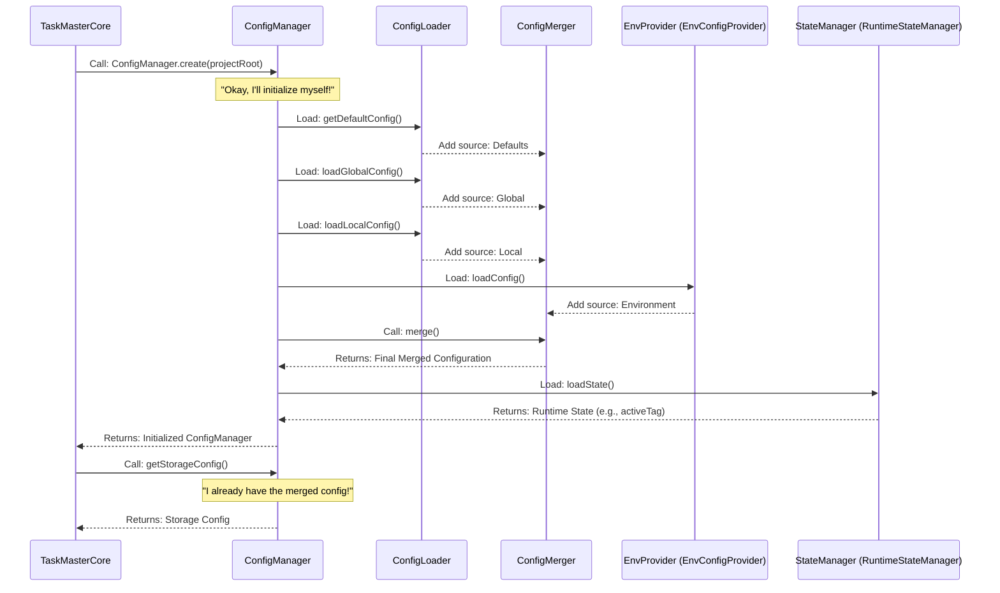

# Chapter 8: Configuration Manager

Welcome back! In [Chapter 7: Storage Layer (IStorage)](07_storage_layer__istorage__.md), we learned how `claude-task-master` wisely separates the "what" of managing tasks from the "how" of saving and loading them, using a smart filing cabinet. Now, let's look at another essential piece of the puzzle: the **Configuration Manager**. This is like the brain that remembers all your preferences and rules for how `claude-task-master` should behave.

## What Problem Does the Configuration Manager Solve?

Imagine you're trying to cook a meal using a recipe.
*   The recipe book might have **default ingredients** (e.g., "use regular salt").
*   Your **personal notes** might say, "always use sea salt instead."
*   And sometimes, a **special request** from your friend might be, "for this specific meal, use low-sodium salt!"

Which salt do you use? You need a clear way to know which instruction takes priority.

Software applications face a similar challenge with their settings:
*   There are **default settings** (e.g., "use Claude Sonnet for AI tasks").
*   You might have **global preferences** on your computer (e.g., "always use English for responses").
*   Each **project** might have its own specific settings (e.g., "for *this* project, save tasks to a special `tasks.json` file").
*   And sometimes, **temporary instructions** from the environment (like a special command-line flag) might override everything else.

If every part of `claude-task-master` had to figure out these priorities every single time, it would be chaotic and prone to errors. The **Configuration Manager** solves this by acting as the **central settings panel** for the entire application. It gathers all settings from different places, merges them according to clear rules, and provides one consistent set of rules for the whole application.

## The Configuration Manager: Your Project's Central Settings Panel

Think of the `Configuration Manager` as the **master controller** for all settings in `claude-task-master`. Its main job is to collect all possible settings and blend them into one definitive configuration that every other part of the application can trust.

Here are the key ideas:

1.  **Multiple Sources of Truth**: Settings can come from various places:
    *   **Defaults**: Built-in values that `claude-task-master` uses if nothing else is specified.
    *   **Global Configuration**: Settings you might have applied across all your `claude-task-master` projects (e.g., in a `~/.config/taskmaster/config.json` file).
    *   **Local Project Configuration**: Specific settings for the current project you're working on (e.g., in a `.taskmaster/config.json` file within your project).
    *   **Environment Variables**: Temporary settings set in your command-line environment or by tools like the [MCP Server](01_mcp_server__model_context_protocol__.md).
2.  **Precedence Rules**: Just like our "salt" analogy, some settings take priority over others. `claude-task-master` follows a strict order:
    *   Environment Variables (highest priority)
    *   Local Project Configuration
    *   Global Configuration
    *   Defaults (lowest priority)
    This means if you set an AI model in your local project's `config.json`, it will override the default AI model. And if you set it in an environment variable, it will override the local project setting.
3.  **Consistent Access**: Once all settings are merged, the `Configuration Manager` provides simple functions (called "getters") to retrieve any setting. This ensures that every part of the application, whether it's the [Task Service](05_task_service__business_logic_layer___.md) needing to know the active tag or the [AI Provider](06_ai_provider__iaiprovider___.md) needing the AI model, uses the correct and up-to-date configuration.
4.  **Runtime State**: Beyond static settings, it also manages dynamic "runtime" information, like which [Tagged Task Lists System](03_tagged_task_lists_system_.md) tag is currently active in your project.

## Use Case: Finding the Active AI Model

Let's say `claude-task-master` needs to know which AI model to use for generating a task description. It won't directly read files or environment variables; instead, it will ask the `Configuration Manager`.

### Getting an AI Model Setting

Here's how other parts of `claude-task-master` (like the [TaskMasterCore (Facade Layer)](02_taskmastercore__facade_layer___.md) or a specific AI service) would ask the `Configuration Manager` for the main AI model:

```typescript
import { ConfigManager } from '@task-master/tm-core/config';

async function getAiModelDetails() {
  // First, create or get the Configuration Manager instance for your project.
  // This step loads and merges all configurations.
  const configManager = await ConfigManager.create('/Users/yourname/my-cool-project');

  // Now, simply ask the ConfigManager for the model configuration.
  const modelConfig = configManager.getModelConfig();

  console.log('--- AI Model Configuration ---');
  console.log(`Main AI Provider: ${modelConfig.main}`);
  console.log(`Fallback AI Provider: ${modelConfig.fallback}`);
  console.log('----------------------------');

  // You can also get other specific settings, like the project root.
  const projectRoot = configManager.getProjectRoot();
  console.log(`Project Root: ${projectRoot}`);

  // Or the currently active task tag.
  const activeTag = configManager.getActiveTag();
  console.log(`Active Task Tag: ${activeTag}`);
}

getAiModelDetails();
```
**Explanation**:
1.  We `import` `ConfigManager` from `tm-core`.
2.  We call `ConfigManager.create()` to get an instance. This important step initializes the manager by loading all configuration sources (defaults, global, local, environment variables) and merging them.
3.  Then, we can simply call methods like `configManager.getModelConfig()`, `configManager.getProjectRoot()`, or `configManager.getActiveTag()` to get the final, merged value for that setting. The `Configuration Manager` handles all the complexity of finding and prioritizing the correct value.

## How It Works Under the Hood: The Orchestrated Merge

When `ConfigManager.create()` is called, it doesn't just read one file. It orchestrates a process involving several specialized internal services to load, merge, and store configuration data.

Here's a simplified view of the initialization flow:



Let's break down the key players and their roles from the code in `packages/tm-core/src/config/config-manager.ts` and its related files.

*   **`ConfigManager`**: The main orchestrator. It holds the final merged configuration and delegates tasks to specialized services.
*   **`ConfigLoader`**: This service is responsible for reading configuration files from specific locations (e.g., `~/.config/taskmaster/config.json` for global, `.taskmaster/config.json` for local). It simply loads raw configuration data.
*   **`EnvironmentConfigProvider`**: This service extracts configuration settings from environment variables (e.g., `TASKMASTER_AI_PROVIDER`).
*   **`ConfigMerger`**: This is the "chef" that takes all the raw configuration ingredients (from defaults, global, local, environment) and combines them into one final, consistent recipe, respecting the precedence rules.
*   **`RuntimeStateManager`**: This service handles the dynamic "state" of the application, like which task tag is currently active. This is not part of the `config.json` but is stored separately (e.g., in `.taskmaster/state.json`).
*   **`ConfigPersistence`**: This service handles saving configuration changes back to files.

### Code Spotlight: The Orchestration of `ConfigManager`

Let's look at simplified code snippets from `packages/tm-core/src/config/config-manager.ts` to see how `ConfigManager` brings all these pieces together.

#### 1. Creating the `ConfigManager` (`static async create`)

This factory method is the official way to get a fully initialized `ConfigManager`.

```typescript
// packages/tm-core/src/config/config-manager.ts (simplified)
export class ConfigManager {
	private initialized = false;
    // ... private services ...

	static async create(projectRoot: string): Promise<ConfigManager> {
		const manager = new ConfigManager(projectRoot); // Step 1: Create an empty manager
		await manager.initialize(); // Step 2: Initialize it (load and merge configs)
		return manager; // Step 3: Return the ready-to-use manager
	}

	// Private constructor to ensure .create() is always used
	private constructor(projectRoot: string) {
		this.projectRoot = projectRoot;
		// Initialize internal services
		this.loader = new ConfigLoader(projectRoot);
		this.merger = new ConfigMerger();
		this.stateManager = new RuntimeStateManager(projectRoot);
		this.persistence = new ConfigPersistence(projectRoot);
		this.envProvider = new EnvironmentConfigProvider();
	}
    // ... more methods ...
}
```
**Explanation**: The `static async create` method ensures that every `ConfigManager` instance is properly set up. It first calls the private `constructor` to create the object and set up its internal helper services (`loader`, `merger`, etc.). Then, it calls the `initialize()` method, which performs the heavy lifting of loading and merging all configuration sources.

#### 2. The Initialization Process (`private async initialize`)

This method is the heart of the `ConfigManager`, where all configuration sources are gathered and merged.

```typescript
// packages/tm-core/src/config/config-manager.ts (simplified)
import { CONFIG_PRECEDENCE } from './services/config-merger.service.js';

export class ConfigManager {
    // ... constructor and other properties ...
	private config: PartialConfiguration = {}; // Holds the final merged config

	private async initialize(): Promise<void> {
		if (this.initialized) return; // Prevent re-initialization

		this.merger.clearSources(); // Clear any old config sources

		// 1. Load default configuration (lowest precedence)
		this.merger.addSource({
			name: 'defaults',
			config: this.loader.getDefaultConfig(),
			precedence: CONFIG_PRECEDENCE.DEFAULTS
		});

		// 2. Load global configuration
		const globalConfig = await this.loader.loadGlobalConfig();
		if (globalConfig) {
			this.merger.addSource({ name: 'global', config: globalConfig, precedence: CONFIG_PRECEDENCE.GLOBAL });
		}

		// 3. Load local project configuration
		const localConfig = await this.loader.loadLocalConfig();
		if (localConfig) {
			this.merger.addSource({ name: 'local', config: localConfig, precedence: CONFIG_PRECEDENCE.LOCAL });
		}

		// 4. Load environment variables (highest precedence)
		const envConfig = this.envProvider.loadConfig();
		if (Object.keys(envConfig).length > 0) {
			this.merger.addSource({ name: 'environment', config: envConfig, precedence: CONFIG_PRECEDENCE.ENVIRONMENT });
		}

		// 5. Merge all configurations into the final config
		this.config = this.merger.merge();

		// 6. Load runtime state (e.g., active tag)
		await this.stateManager.loadState();

		this.initialized = true;
	}
    // ... more methods ...
}
```
**Explanation**: The `initialize` method is a carefully choreographed sequence. It asks the `ConfigLoader` to get default, global, and local configurations. It asks the `EnvironmentConfigProvider` for environment variables. Each loaded configuration is then `addSource`'d to the `ConfigMerger` along with its `precedence`. Finally, `this.merger.merge()` is called, which takes all these sources and produces one final, consistent `this.config` object, applying all the precedence rules. It also loads the `runtime state` using the `StateManager`.

#### 3. Getting Specific Configuration Settings (`getStorageConfig`, `getActiveTag`)

Once initialized, the `ConfigManager` provides various "getter" methods to easily retrieve parts of the merged configuration.

```typescript
// packages/tm-core/src/config/config-manager.ts (simplified)
import type { RuntimeStorageConfig } from '../interfaces/configuration.interface.js';

export class ConfigManager {
    // ... constructor, initialize, other properties ...

	/**
	 * Get storage configuration
	 */
	getStorageConfig(): RuntimeStorageConfig {
		const storage = this.config.storage; // Access the merged config

		// Return the configured type (including 'auto')
		const storageType = storage?.type || 'auto';
		const basePath = storage?.basePath ?? this.projectRoot;

		// Special handling for API storage properties
		if (storageType === 'api' || storageType === 'auto') {
			return {
				type: storageType,
				basePath,
				apiEndpoint: storage?.apiEndpoint,
				apiAccessToken: storage?.apiAccessToken,
				apiConfigured: Boolean(storage?.apiEndpoint || storage?.apiAccessToken)
			};
		}
		// Default file storage configuration
		return { type: storageType, basePath, apiConfigured: false };
	}

	/**
	 * Get the currently active tag (from runtime state)
	 */
	getActiveTag(): string {
		return this.stateManager.getCurrentTag(); // Delegates to RuntimeStateManager
	}

	/**
	 * Get response language setting
	 */
	getResponseLanguage(): string {
		const customConfig = this.config.custom as any; // Access the merged config
		return customConfig?.responseLanguage || 'English';
	}
    // ... more methods ...
}
```
**Explanation**: These getter methods demonstrate how `ConfigManager` provides easy access to specific parts of the configuration. `getStorageConfig()` directly inspects the `this.config` object and also adds some computed properties like `apiConfigured`. `getActiveTag()` delegates to the `RuntimeStateManager`, showing how `ConfigManager` integrates dynamic state. `getResponseLanguage()` also directly accesses the `this.config` object, providing a default if the setting isn't found.

#### 4. Updating Configuration (`updateConfig`)

The `ConfigManager` also provides a way to update and save configuration changes.

```typescript
// packages/tm-core/src/config/config-manager.ts (simplified)
import type { PartialConfiguration } from '../interfaces/configuration.interface.js';

export class ConfigManager {
    // ... constructor, initialize, getters ...

	/**
	 * Update configuration with partial changes
	 */
	async updateConfig(updates: PartialConfiguration): Promise<void> {
		// 1. Merge updates into the current configuration held in memory
		Object.assign(this.config, updates);

		// 2. Save the updated configuration to the local config file
		await this.persistence.saveConfig(this.config);

		// 3. Re-initialize to ensure precedence rules are re-applied
		// (e.g., if an environment variable was set, it might override the new saved config)
		this.initialized = false;
		await this.initialize();
	}

	/**
	 * Set response language (simplified helper for a specific setting)
	 */
	async setResponseLanguage(language: string): Promise<void> {
		if (!this.config.custom) {
			this.config.custom = {};
		}
		(this.config.custom as any).responseLanguage = language;
		await this.persistence.saveConfig(this.config);
	}
    // ... more methods ...
}
```
**Explanation**: When you call `updateConfig`, the `ConfigManager` first applies the `updates` to its internal `this.config` object. Then, it uses the `ConfigPersistence` service to write these changes to the local configuration file (e.g., `.taskmaster/config.json`). Finally, it calls `this.initialize()` again. This re-initialization is crucial because it re-loads *all* sources (including environment variables) and re-applies the precedence rules, ensuring that the system always uses the absolutely correct, highest-priority settings.

## Conclusion

The `Configuration Manager` is the unsung hero of `claude-task-master`, providing a robust and flexible way to manage all application settings. By gathering configurations from multiple sources, applying strict precedence rules, and delegating tasks to specialized services, it ensures that every part of the application operates with a consistent and reliable set of instructions. This central control panel makes `claude-task-master` adaptable, easy to customize, and resistant to conflicting settings, no matter how complex your projects become.

---

<sub><sup>Generated by [AI Codebase Knowledge Builder](https://github.com/The-Pocket/Tutorial-Codebase-Knowledge).</sup></sub> <sub><sup>**References**: [[1]](https://github.com/eyaltoledano/claude-task-master/blob/b7f32eac5a1eb90ec93cc4597def716335dc4b5f/packages/tm-core/src/config/config-manager.ts), [[2]](https://github.com/eyaltoledano/claude-task-master/blob/b7f32eac5a1eb90ec93cc4597def716335dc4b5f/packages/tm-core/src/config/index.ts), [[3]](https://github.com/eyaltoledano/claude-task-master/blob/b7f32eac5a1eb90ec93cc4597def716335dc4b5f/packages/tm-core/src/interfaces/configuration.interface.ts), [[4]](https://github.com/eyaltoledano/claude-task-master/blob/b7f32eac5a1eb90ec93cc4597def716335dc4b5f/scripts/modules/config-manager.js)</sup></sub>