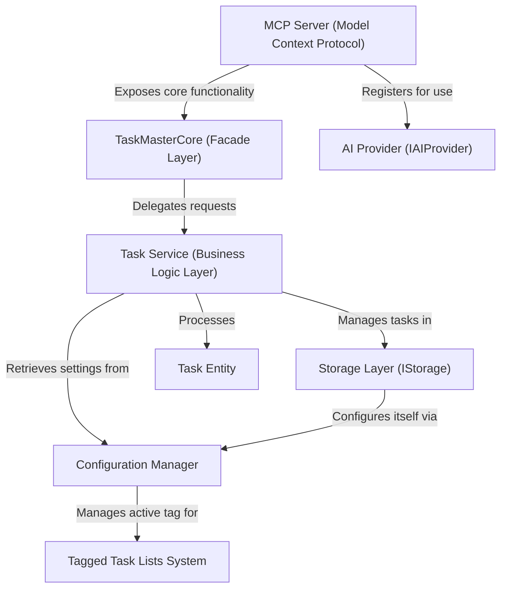

# Tutorial: claude-task-master

The `claude-task-master` project is an *AI-powered assistant* designed to **streamline software development workflows**.
It helps users manage and organize their coding tasks, breaking down complex features into smaller steps,
and leverages **advanced AI capabilities** for research, task generation, and dynamic adjustments.
Developers can easily organize their work using *tagged task lists* for different features or collaborations,
making complex projects more manageable.

## Visual Overview

## Chapters

1. [MCP Server (Model Context Protocol)
](01_mcp_server__model_context_protocol__.md)
2. [TaskMasterCore (Facade Layer)
](02_taskmastercore__facade_layer__.md)
3. [Tagged Task Lists System
](03_tagged_task_lists_system_.md)
4. [Task Entity
](04_task_entity_.md)
5. [Task Service (Business Logic Layer)
](05_task_service__business_logic_layer__.md)
6. [AI Provider (IAIProvider)
](06_ai_provider__iaiprovider__.md)
7. [Storage Layer (IStorage)
](07_storage_layer__istorage__.md)
8. [Configuration Manager
](08_configuration_manager_.md)

---

Generated by [AI Codebase Knowledge Builder](https://github.com/The-Pocket/Tutorial-Codebase-Knowledge).